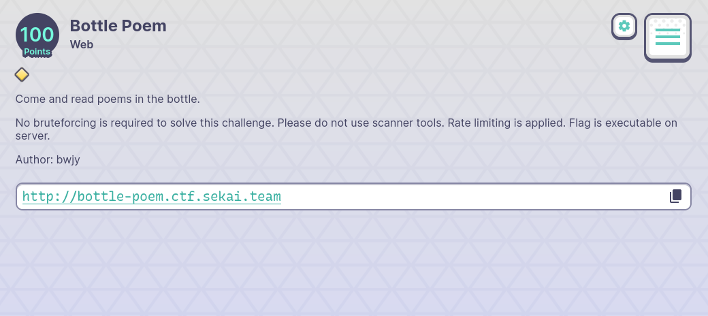
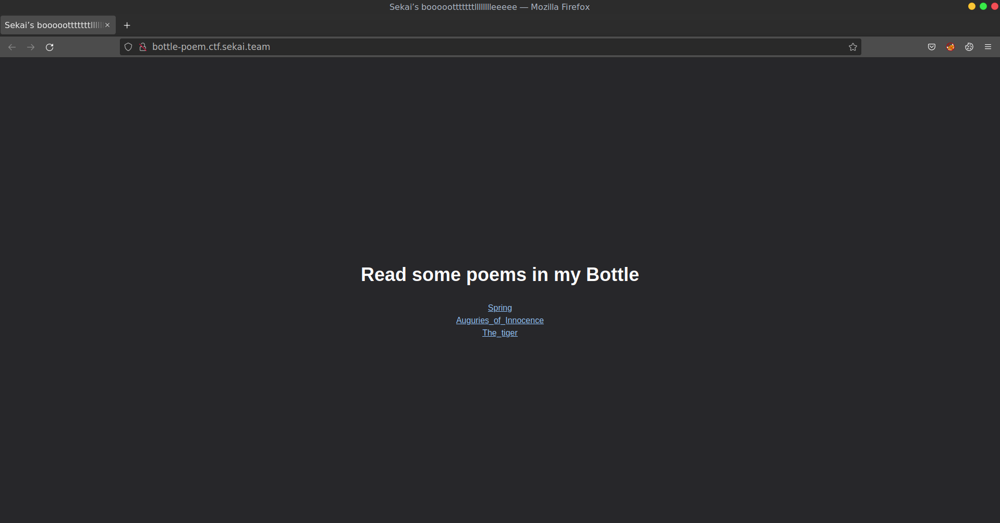
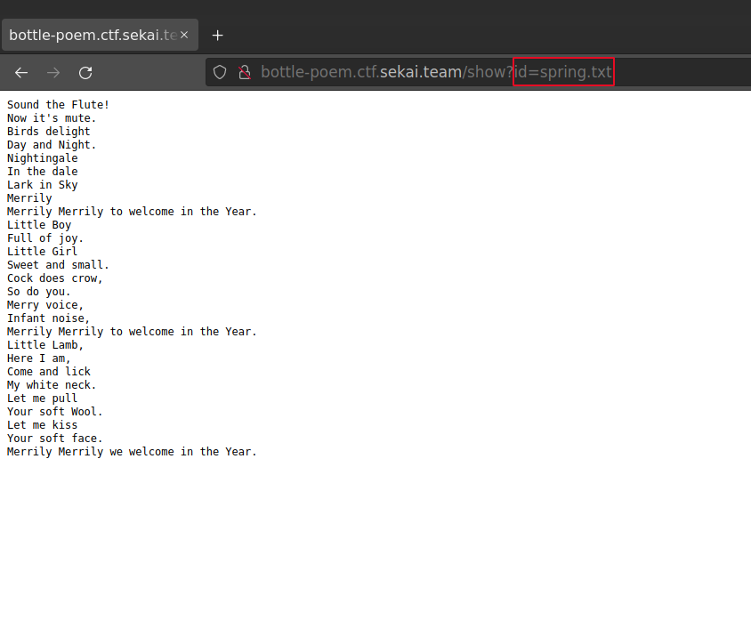
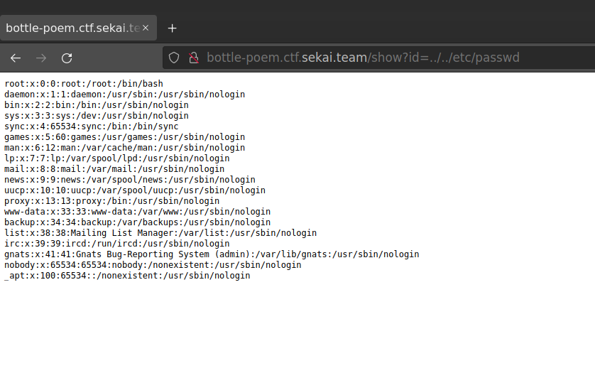
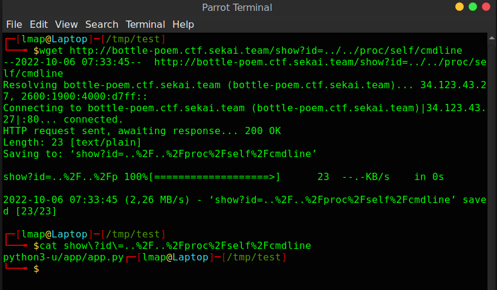
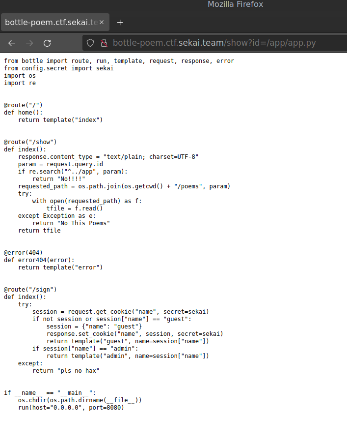
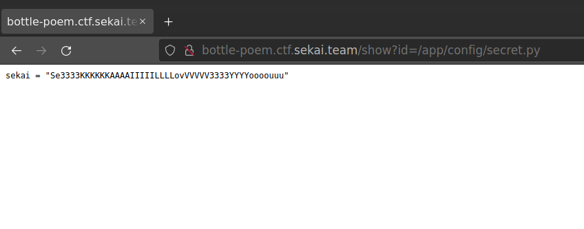
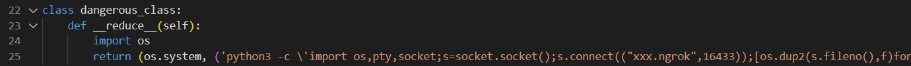
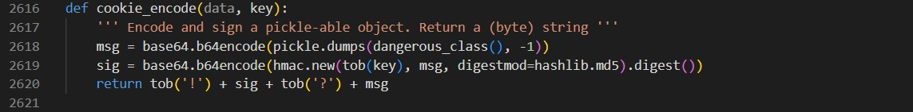
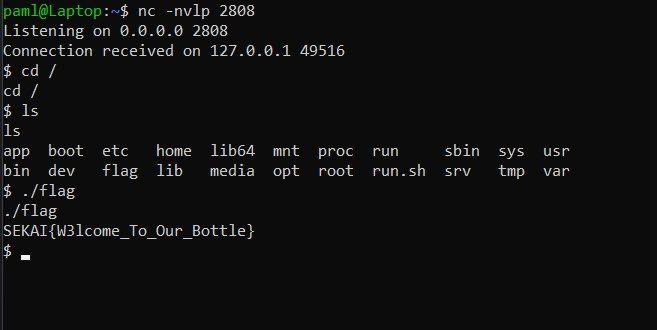

# Bottle Poem

## 😁Fun but not
This is the second time I have written write-up for this challenge. I have deleted the first edition by accident `rm -rf *` 😭

## 📄Desription
The sentence "Flag is executable on server" makes me know that I need to do RCE.



## 👨‍💻Explore the website
We have three links on the home page:



Click on one of them, the server gives us a poem.



Give notice on GET parameter `id=string.txt`, we should test for path traversal by changing `string.txt` to `../../etc/passwd` - typical payload, right?



🥳 Yay :v Path traversal detected :v Next, I decided to read `/proc/self/cmdline`, this is a file that the command to start the current process (web). 



The author has executed `python3 -u /app/app.py`. `/app/app.py` can be the main source code. Just try to read it.



In `app.py` there is an interesting endpoint `/sign`. By reading the source code, we know there are `/views/admin.html`, `/views/guest.html`, `/views/error.html` and `/views/index.html` but none of them gives us the flag. We also can obtain the secret `sekai` by reading `/app/config/secret.py` because there is `from config.secret import sekai` in `app.py`.



With that secret, we can control cookies 🍪. Remember what we need is RCE. So I have searched for an issue in the Bottle framework and have found [this](https://github.com/bottlepy/bottle/issues/900). Bottle uses `pickle` module to serialize data in cookies processing that leads to RCE ([more](https://www.youtube.com/watch?v=jwzeJU_62IQ)).
## 💣Exploitation:
- Set up TCP netcat for reverse shell.
- Download Bottle framework and edit source code to make Bottle serialize our dangerous instance.
    - Add a dangerous class:
    
    - Make sure Bottle always serialize dangerous instance:
    
- Use challenge's secret key `sekai` to encrypt/sign our new cookie and then send that cookie to server `/sign` to get RCE. Code below.
    ```py
    from bottle import route, run, template, request, response, error
    import os
    import re

    sekai = "Se3333KKKKKKAAAAIIIIILLLLovVVVVV3333YYYYoooouuu"

    @route("/")
    def index():
        response.set_cookie("name", "xxx", secret=sekai)
        return "hehe"

    if __name__ == "__main__":
        # os.chdir(os.path.dirname(__file__))
        run(host="0.0.0.0", port=8080)

    ```
    


## 🚩Flag: SEKAI{W3lcome_To_Our_Bottle}
