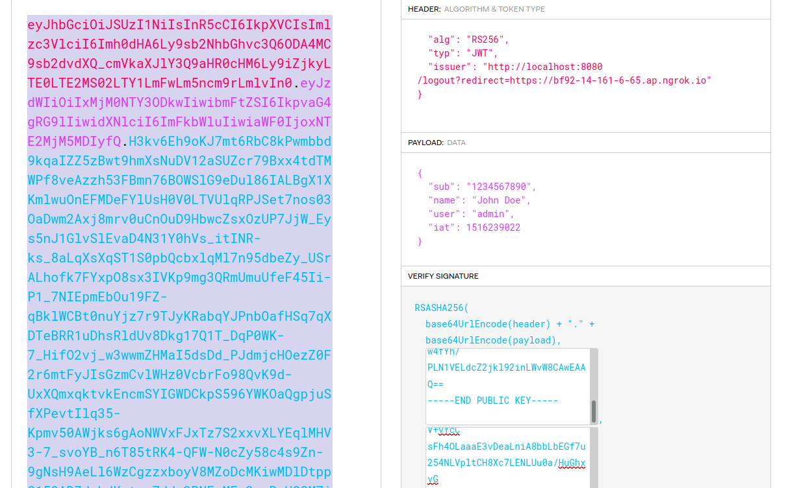
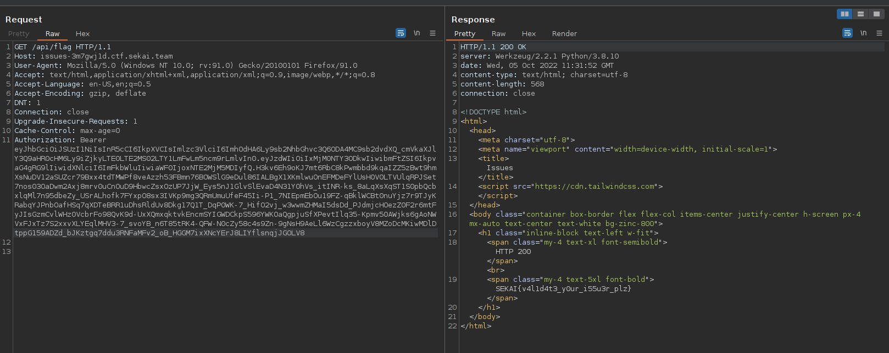

# Issues
## 📄 Description
We need to bypass something to become an admin.


## 💻 Explore the website


There's nothing special here, so skip to the next part.

## 🧑‍💻Source code
There are some endpoints in `app.py` but there are only two endpoints that do something seriously:
```py
@app.route("/.well-known/jwks.json")
def jwks():
    return jwks_contents, 200, {'Content-Type': 'application/json'}


@app.route("/logout")
def logout():
    session.clear()
    redirect_uri = request.args.get('redirect', url_for('home'))
    return redirect(redirect_uri)
```
- `/.well-known/jwks.json`: give us a public key that the server uses to validate the JWT token (maybe).
- `/logout`: navigate to `redirect` get parameter or `/home`.

In `api.py`, we have:
- `/api/flag`: this will give us flag, but not so fast.
- To access `/api/flag` we must give the server a valid JWT token.
```py
f = open("flag.txt")
secret_flag = f.read()
f.close()


@api.route("/flag")
def flag():
    return secret_flag
```

How does the server validate the JWT token? 🤔

```py
valid_issuer_domain = os.getenv("HOST")
valid_algo = "RS256"


def get_public_key_url(token):
    is_valid_issuer = lambda issuer: urlparse(issuer).netloc == valid_issuer_domain

    header = jwt.get_unverified_header(token)
    if "issuer" not in header:
        raise Exception("issuer not found in JWT header")
    token_issuer = header["issuer"]

    if not is_valid_issuer(token_issuer):
        raise Exception(
            "Invalid issuer netloc: {issuer}. Should be: {valid_issuer}".format(
                issuer=urlparse(token_issuer).netloc, valid_issuer=valid_issuer_domain
            )
        )

    pubkey_url = "{host}/.well-known/jwks.json".format(host=token_issuer)
    return pubkey_url

def get_public_key(url):
    resp = requests.get(url)
    resp = resp.json()
    key = resp["keys"][0]["x5c"][0]
    return key


def has_valid_alg(token):
    header = jwt.get_unverified_header(token)
    algo = header["alg"]
    return algo == valid_algo


def authorize_request(token):
    pubkey_url = get_public_key_url(token)
    if has_valid_alg(token) is False:
        raise Exception("Invalid algorithm. Only {valid_algo} allowed.".format(valid_algo=valid_algo))

    pubkey = get_public_key(pubkey_url)
    pubkey = "-----BEGIN PUBLIC KEY-----\n{pubkey}\n-----END PUBLIC KEY-----".format(pubkey=pubkey).encode()
    decoded_token = jwt.decode(token, pubkey, algorithms=["RS256"])
    if "user" not in decoded_token:
        raise Exception("user claim missing")
    if decoded_token["user"] == "admin":
        return True

    return False


@api.before_request
def authorize():
    if "Authorization" not in request.headers:
        raise Exception("No Authorization header found")

    authz_header = request.headers["Authorization"].split(" ")
    if len(authz_header) < 2:
        raise Exception("Bearer token not found")

    token = authz_header[1]
    if not authorize_request(token):
        return "Authorization failed"
```

The author wanted to add an `issuer` header in JWT so he (or she) implemented it by hand. The flow is: 
```
-> authorize()
        -> authorize_request()
                -> get_public_key_url()
                -> has_valid_alg()
                -> get_public_key()
```

- `authorize()` will ensure there is valid `Authorization` field in request header `Authorization: <name> <token></token>`.
- After that, the token will be passed to `authorize_request()` to validate the token. In `authorize_request()`:
    - Use `get_public_key_url()` to ensure netloc of `issuer` header is equal to `valid_issuer_domain`. And then return `{host}/.well-known/jwks.json` (with `host` is the value of `issuer` field). It is where the public key is stored to validate the JWT token. The author checks `urlparse(issuer).netloc == valid_issuer_domain` because he (or she) trusts server he (or she) controls.
    - Use `has_valid_alg()` to ensure value of `alg` header is `RS256`.
    - User `get_public_key()` to get public key from result of `get_public_key_url()`.
    - Validate token.
    - Return `true` if `user` in body is `admin`, `false` otherwise.
- If all the above steps are passed, we can get the flag.

## 🤔But how? 
- The key is that people use public key to validate the JWT. So:
    1. We can generate an RS256 key pair.
    2. Convert public key into JWK format.
    3. Host a server with endpoint `/.well-known/jwks.json` which will return our public key in JWK format.
    4. Change the `issuer` header field to the trusted domain (`localhost:8080`) (but contains our public key) to bypass netloc checking and the `user` body field to `admin`.
    5. Use our private key to sign our data.
    6. Access `http://issues-3m7gwj1d.ctf.sekai.team/api/flag` to see the response.

- In step 4, we use `http://localhost:8080/logout?redirect=<our domain>` because it will bypass netloc checking and return our public key in JWK format.



## 🚩Flag: SEKAI{v4l1d4t3_y0ur_i55u3r_plz}