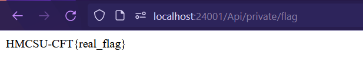

# Cute Quote: 
Since the server is currently offline, I will set up a localhost web server to perform the necessary tasks locally.

If we look at the app.js file, we can obtain the flag from there.
```js
app.get('/api/private/flag', (req, res) => {
  res.send(flag)
})
```

Look at nginx configuration file.

```nginx
location /api/private/ {
    return 403; # disable private api
}
```

The application disables the private API, but we can bypass it by using /Api/private (with a capital A).

So, access to `/Api/private/flag` to get the flag.

