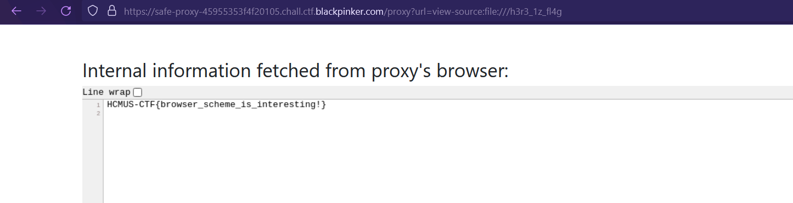

# Safe Proxy

The server is off so I will write my memory :)

It's an application that can only be accessed from localhost, but we can access to a proxy server that can capture the screenshot of a web page with user-controllable URL.

The description says the flag is on the proxy server so the application may be pointless.

I used the proxy server to capture the screenshot of my webhook and the user agent of the incoming request was
`User-Agent: Mozilla/5.0 (X11; Linux x86_64) AppleWebKit/537.36 (KHTML, like Gecko) HeadlessChrome/113.0.5672.63 Safari/537.36`.

So it uses headless Chrome to open the URL and capture a screenshot.
I tried using `file:///etc/passwd`, but it returned an invalid URL scheme error. However, when I used `view-source:file:///etc/passwd`, it worked.

So I tried using `view-source:file:///` and was able to retrieve the flag file, which has the filename h3r3_1z_fl4g.

And I used `view-source:file:///h3r3_1z_fl4g` to get the flag.
